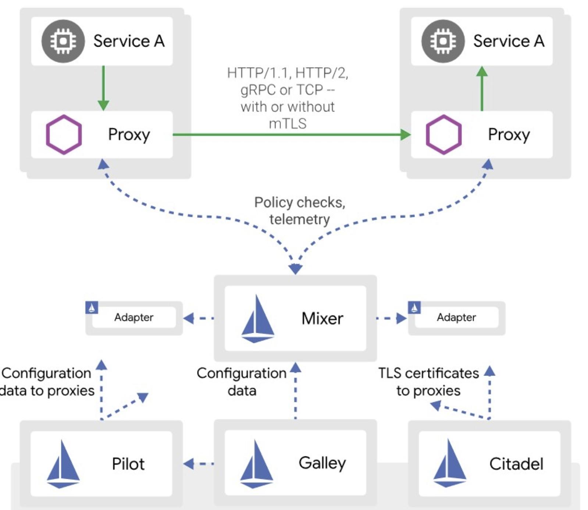
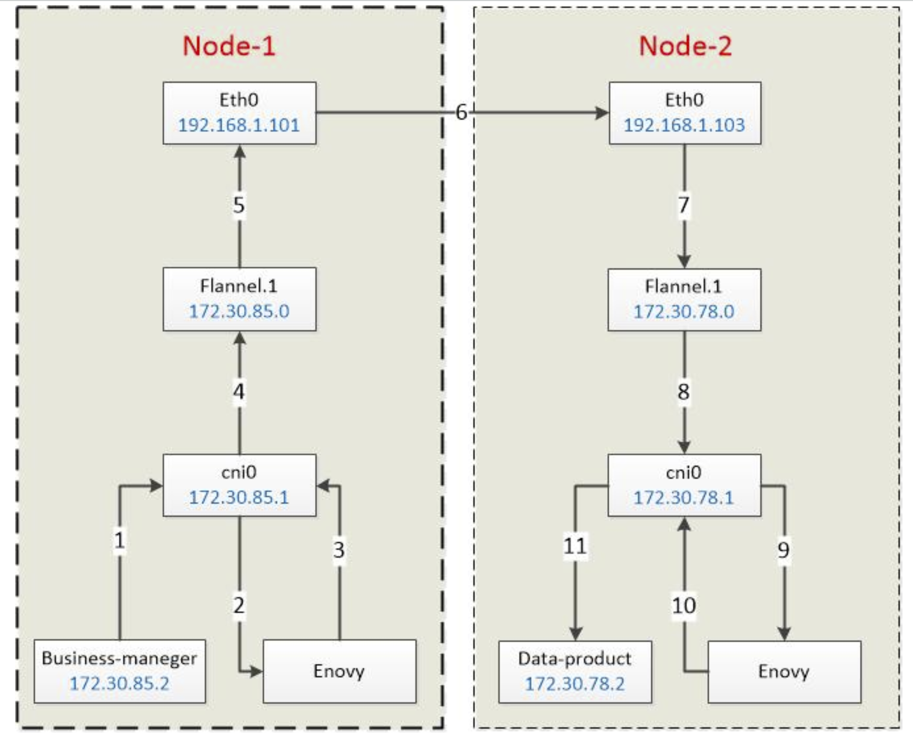
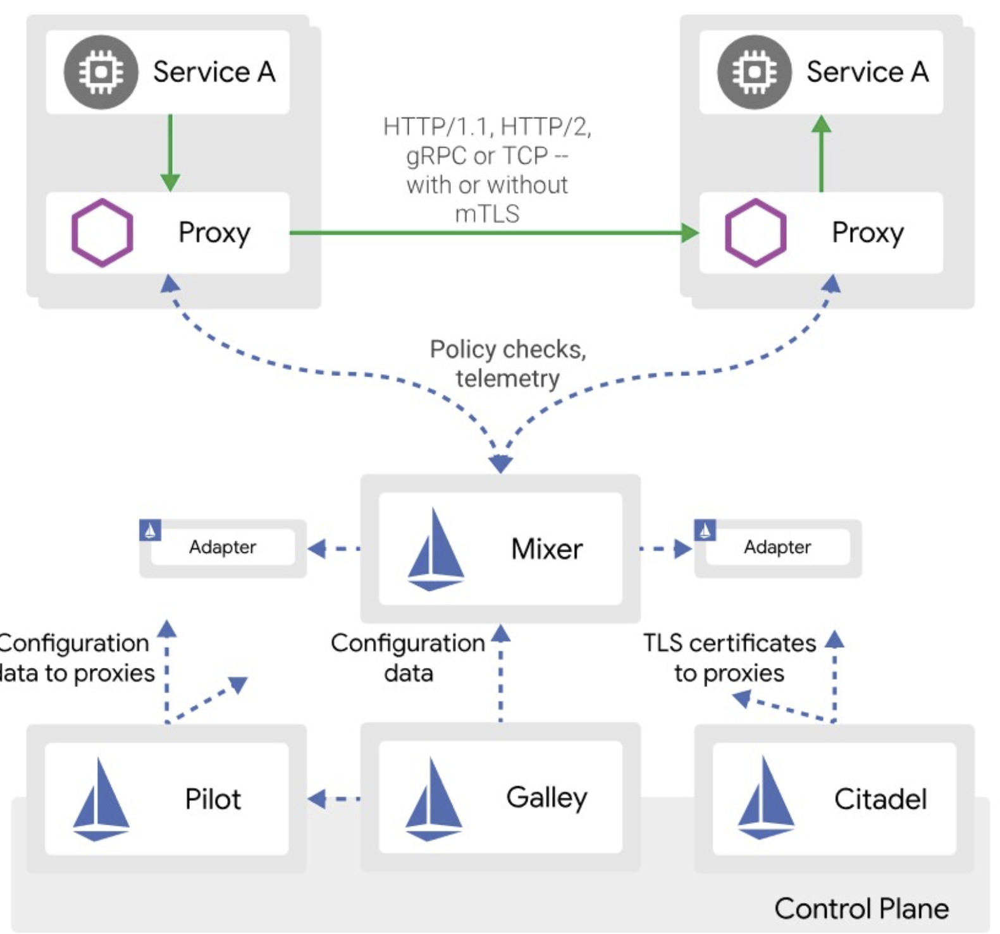
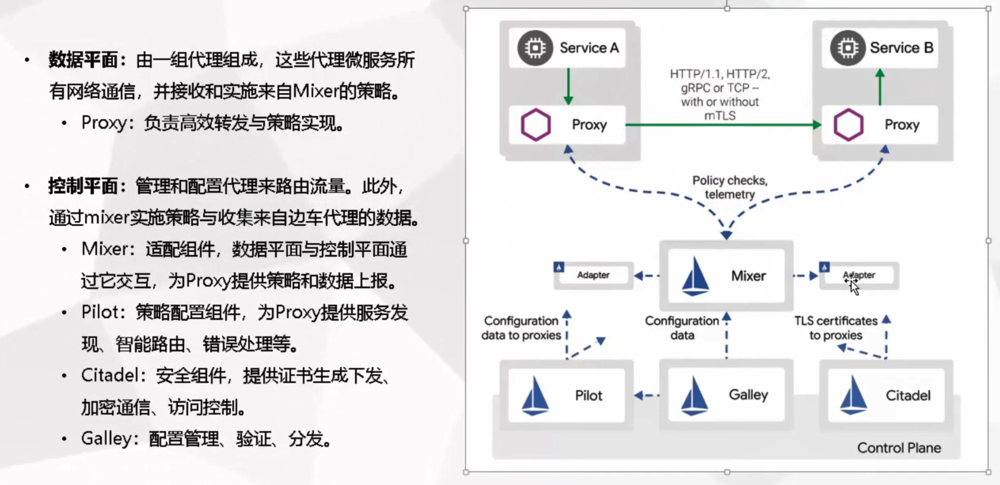

# 1 介绍

## 什么是service mesh

在从单体应用程序向分布式微服务架构的转型过程中，开发人员和运维人员面临诸多挑战，使用 Istio 可以解决这些问题。

服务网格（Service Mesh）这个术语通常用于描述构成这些应用程序的微服务网络以及应用之间的交互。随着规模和复杂性的增长，服务网格越来越难以理解和管理。它的需求包括服务发现、负载均衡、故障恢复、指标收集和监控以及通常更加复杂的运维需求，例如 A/B 测试、金丝雀发布、限流、访问控制和端到端认证等。

Istio 提供了一个完整的解决方案，通过为整个服务网格提供行为洞察和操作控制来满足微服务应用程序的多样化需求。

## 什么是Istio

Istio 提供一种简单的方式来为已部署的服务建立网络，该网络具有负载均衡、服务间认证、监控等功能，只需要对服务的代码进行[一点](https://link.juejin.cn/?target=https%3A%2F%2Fistio.io%2Fzh%2Fdocs%2Ftasks%2Ftelemetry%2Fdistributed-tracing%2Foverview%2F%23trace-context-propagation)或不需要做任何改动。想要让服务支持 Istio，只需要在您的环境中部署一个特殊的 sidecar 代理，使用 Istio 控制平面功能配置和管理代理，拦截微服务之间的所有网络通信：

- HTTP、gRPC、WebSocket 和 TCP 流量的自动负载均衡。
- 通过丰富的路由规则、重试、故障转移和故障注入，可以对流量行为进行细粒度控制。
- 可插入的策略层和配置 API，支持访问控制、速率限制和配额。
- 对出入集群入口和出口中所有流量的自动度量指标、日志记录和追踪。
- 通过强大的基于身份的验证和授权，在集群中实现安全的服务间通信。

Istio 旨在实现可扩展性，满足各种部署需求。

# 2 架构和原理

 

## 2.1 Proxy代理

Istio的核心原理，是网络代理，拦截下所有想拦截的流量，然后想干啥就干啥吧。
Istio使用的代理组件是Lyft团队的Envoy，一个C++开发的高性能代理。这是Lyft在Istio项目里的唯一贡献，却让Lyft排在跟Google/IBM并列的位置，可想而知Envoy对Istio的重要性。

 

Envoy之所以有能力拦截下所有的流量，是因为它被设计为部署在每一个需要管理的Pod里，作为一个独立容器存在，支持通过配置iptables或cni网桥两种方式来拦截流量（这里也不展开说了，还不明白的同学可以翻看我之前发的k8s底层网络的说明，看看Flannel的实现原理），请看上图，Business-manager容器的请求发出时，会经过本Pod的Enovy代理，Enovy完成规则校验、数据采集、日志等操作后，再转发出去；值得注意的是，请求方Enovy转发出去的流量会发送给接收方的Enovy，之后才有可能到达真正的接收方data-product容器。当然这些操作是Istio的活，我们要做的仅仅是通过配置的形式告诉Istio我们要对哪些流量做什么动作。
通过对拦截下来的流量的解析和修改（是的，理论上什么都能干，包括修改甚至丢弃流量），Envoy包括但不限于以下功能：
• 动态服务发现
• 负载均衡
• TLS 终止
• HTTP/2 & gRPC 代理
• 熔断器
• 健康检查、基于百分比流量拆分的灰度发布
• 故障注入
• 丰富的度量指标

## 2.2 Mixer混合器

顾名思义，Mixer混合了各种策略以及后端数据采集或遥测系统的适配器，从而实现了前端Proxy与后端系统的隔离与汇合。Mixer是一个灵活的插件模型（有没有发现无论是k8s还是Istio，实现上都很青睐于插件模型，这是一个很灵活的实现方式），它一端连着Envoy，同时我们可以将日志、监控、遥测等各种系统“插入”到Mixer的另一端中，从而得到我们想要的数据或结果。

 

我们来看下官方的Mixer拓扑图，Mixer被设计为一个独立运行的模块，它可以“插入”logging日志、quota指标、auth安全认证、Tele遥测等很多模块。每插入一个模块都会在前端生成一个规则过滤器。前端的Enovy在每次流量到来时，都会请求Mixer，匹配每一个过滤器。

这就涉及到性能问题了，所以Istio在这个拓扑下设计了一个二级缓存系统。Envoy端在每个Pod里有一个一级缓存，当然这个缓存不能太大；Mixer端会有一个二级缓存，由于Mixer是独立运行的，所以这个缓存可以设计的比较大。这样Envoy可以预先缓存一部分规则，只有当规则缺失时才需要向Mixer请求，这就减少了每次流量到来的网络请求次数；另一方面，日志等数据上送，也是异步执行的，先经过一级缓存、二级缓存再到达后端存储或处理系统。

## 2.3 Pilot引导

简单来说，Pilot是为我们提供配置智能路由（如A/B测试、金丝雀发布等）、弹性（超时、重发、熔断等）等功能的管理系统，它提供了一系列rules api，允许运维人员指定一系列高级的流量管理规则。Pilot负责将我们的配置转换并写入到每个sidecar（Enovy）。

## 2.4 Citadel堡垒

这个名字也很有意思，它管理着集群的密钥和证书，是集群的安全部门。典型的如果我们的服务是跨网络通讯（Istio允许我们建立一个安全的集群的集群网络），开发人员想省事懒得对通讯数据进行加解密和身份认证，这事就可以交给Citadel来处理了。更详细的说，Istio各个模块在安全性上分别扮演以下角色：
• Citadel，用于密钥和证书管理
• Sidecar和周边代理，实现客户端和服务器之间的安全通信
• Pilot，将授权策略和安全命名信息分发给代理
• Mixer，管理授权和审计
这一块应该暂时用不上，也不展开说了。

## 2.5 Galley

从官网的说法来看，后面这个组件会逐步接管获取配置、处理和分配的工作，比如从k8s的数据中心（etcd）获取集群信息的活，理论上应该交给Galley干。从这个信息来看，Galley的定位应该类似于k8s的api server组件，提供集群内统一的配置信息接口，从而将用户配置的细节隔离开来。

## 2.6 架构和组件图快速理解

 

## 2.7 istio基本概念

### 4个配置资源

这4个配置资源，落地所有流量管控需求

* VirtualService: 实现服务请求路由规则的动能
* DestinationRule: 实现目标服务的负载均衡、服务发现、故障处理和故障注入的功能
* Gateway: 让服务网格内的服务，可以被全世界看到
* ServiceEntry: 让服务网格内的服务，可以看到外面的世界

# 3 功能列表

以下是从官网各项示例中整理出来的Istio所支持的功能列表：

|          |                  |                                                              |
| :------- | ---------------: | :----------------------------------------------------------: |
| 类别     |             功能 |                             说明                             |
| 流量管理 |         请求路由 | A/B测试、金丝雀发布等，包括对集群出入口、及集群内部的流量的控制。比如某应用新版本发布，可以配置为5%的流量流向新版本，95%的给旧版本 |
|          |         流量转移 | 与上一条请求路由类似，可以平滑的将流量从旧版本转移到新版本上 |
|          |         负载均衡 |        目前支持3种方式，轮询、随机和带权重的最少请求         |
|          |         服务发现 |       带心跳的健康检查，失败率超标的Pod移出负载均衡池        |
|          |         故障处理 |       超时、重发、熔断、上游并发请求或下游连接数限制等       |
|          |             微调 |        支持用特殊的请求头参数，覆盖默认的超时、重发值        |
|          |         故障注入 | 由Enovy在正常的集群中人为注入故障，比如TCP包损坏或延迟、HTTP错误码等，支持按百分比注入，比如给10%的流向服务A的请求包增加5秒延迟 |
|          |         多重匹配 | 上述规则的配置，支持按多种条件匹配，且支持and或or的方式匹配多条规则 |
|          |          Gateway | 接管集群入口的流量，替代了Ingress，从而对入口流量执行其他规则 |
|          |    Service Entry |  接管集群内部访问外部服务的流量，从而对出口流量执行一些规则  |
|          |             镜像 | 支持将特定的流量镜像到服务路径之外，而不影响主服务路径的正常执行 |
| 安全     | 命名空间访问控制 |   支持配置某命名空间的所有或个别服务可以被其他命名空间访问   |
|          | 服务级别访问控制 |                    允许或禁止访问某个服务                    |
|          |          双向TLS |                        HTTPS加密传输                         |
|          |     其他安全策略 |                                                              |
| 策略     |         速率限制 |                    比如限制每秒的请求次数                    |
|          |         黑白名单 |               支持基于IP或属性的黑名单、白名单               |
| 遥测     |         日志收集 | 支持将Prometheus、Jaeger等系统插入Mixer，从而完成数据的采集  |
|          |         指标采集 |                                                              |
|          |       分布式追踪 |                                                              |

# 4 性能评估

官方给出了对最新版本V1.1.4的性能测试结果。在由1000个服务和2000个sidecar组成，每秒产生70000个网格范围内的请求的网格中，得到以下结果：
• Envoy在每秒处理 1000 请求的情况下，使用 0.6 个 vCPU 以及 50 MB 的内存。
• istio-telemetry在每秒1000个网格范围内的请求的情况下，消耗了0.6个vCPU。
• Pilot使用了 1 个 vCPU 以及 1.5 GB 的内存。
• Envoy在第 90 个百分位上增加了 8 毫秒的延迟。