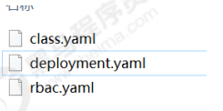
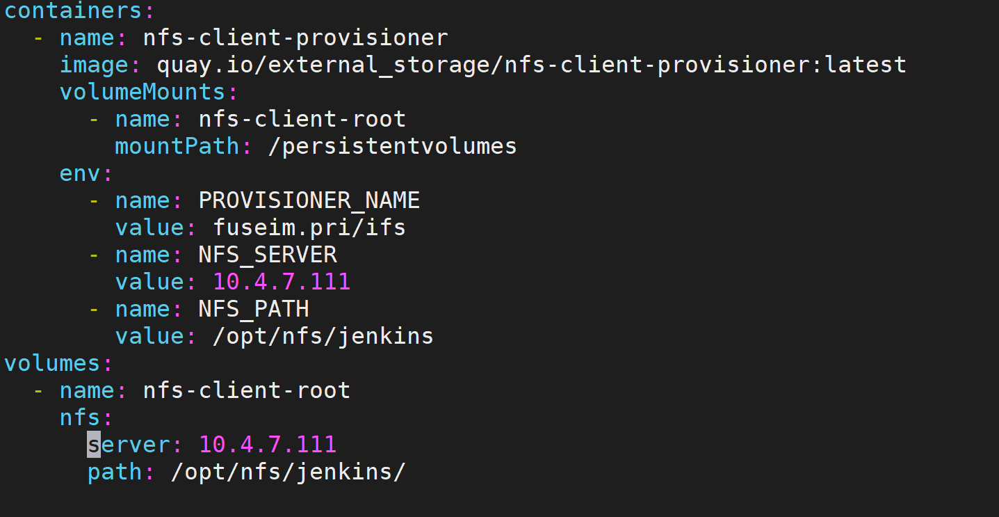
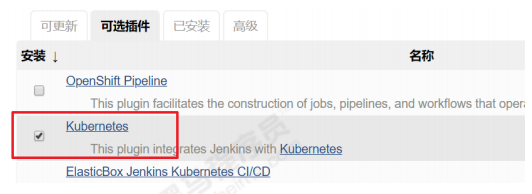
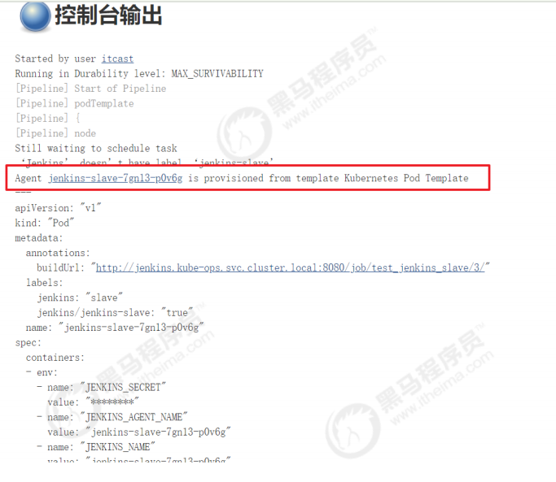
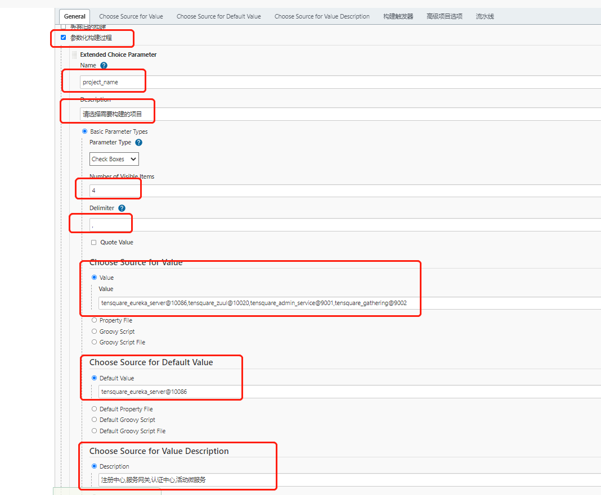
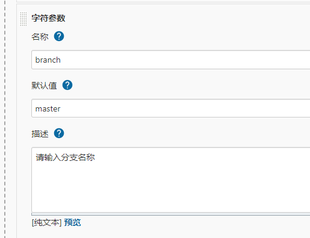
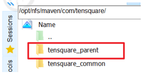
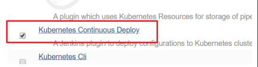
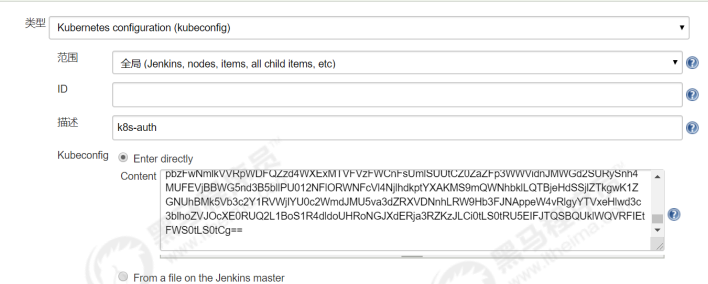
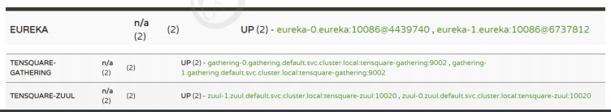

# springcloud发布到k8s概述

## 项目概述

> jenkins+harbor+gitlab+docker+k8s+springcloud

> 项目架构：前后端分离
>
> 后端技术栈：SpringBoot + SpringCloude + SpringDataJpa (Spring全家桶)

## 微服务项目结构

> tensquare_parent
>   tensquare_admin_service
>   tensquare_common
>   tensquare_eureka_server
>   tensquare_gathering
>   tensquare_zuul
>   pom.xml
>
> * tensquare_parent：父工程，存放基础配置
> * tensquare_common：通用工程，存放工具类
> * tensquare_eureka_server：SpringCloud的 Eureka注册中心
> * tensquare_zuul：SpringCloud的网关服务
> * tensquare_admin_service：基础权限认证中心，负责用户认证（jwt）
> * tensquare_gathering ：一个简单的业务模块，活动微服务相关逻辑


# 资源准备

| 机器       | 服务          | 说明                             |
| ---------- | ------------- | -------------------------------- |
| 10.4.7.100 | gitlab        | 代码仓库，安装gitlab             |
| 10.4.7.101 | jenkins       | jenkins服务，安装jenkins, docker |
| 10.4.7.107 | k8s-master01  |                                  |
| 10.4.7.108 | k8s-master02  |                                  |
| 10.4.7.109 | k8s-master03  |                                  |
| 10.4.7.236 | k8s-master-lb | keepalived虚拟IP                 |
| 10.4.7.110 | k8s-node01    |                                  |
| 10.4.7.111 | k8s-node02    |                                  |


| **配置信息** |      备注      |
| :----------: | :------------: |
|   系统版本   |   CentOS 7.9   |
|  Docker版本  |    19.03.x     |
|   Pod网段    | 172.168.0.0/12 |
| Service网段  |  10.96.0.0/12  |


# k8s集群安装

> 参考二进制安装k8s-1.20章节

# gitlab安装

1. 安装相关依赖

  ```shell
$ yum -y install policycoreutils openssh-server openssh-clients postfix
  ```

  

2. 启动ssh服务&设置为开机启动

  ```shell
$ systemctl enable sshd && sudo systemctl start sshd
  ```

  

3. 设置postfix开机自启，并启动，postfix支持gitlab发信功能

  ```shell
$ systemctl enable postfix && systemctl start postfix
  ```

  

4. 开放ssh以及http服务，然后重新加载防火墙列表

  ```shell
$ firewall-cmd --add-service=ssh --permanent
$ firewall-cmd --add-service=http --permanent
$ firewall-cmd --reload
  ```

  如果关闭防火墙就不需要做以上配置

5. 下载gitlab包，并且安装
   在线下载安装包：

  ```shell
$ wget https://mirrors.tuna.tsinghua.edu.cn/gitlab-ce/yum/el6/gitlab-ce-12.4.2-ce.0.el6.x86_64.rpm
  ```

  安装：

  ```shell
$ rpm -i gitlab-ce-12.4.2-ce.0.el6.x86_64.rpm
  ```

  

6. 修改gitlab配置

  ```shell
$ vi /etc/gitlab/gitlab.rb
  ```

  修改gitlab访问地址和端口，默认为80，我们改为82

  ```
external_url 'http://10.4.7.100:82'
nginx['listen_port'] = 82
  ```

  

7. 重载配置及启动gitlab

  ```shell
$ gitlab-ctl reconfigure
$ gitlab-ctl restart
  ```

  

8. 把端口添加到防火墙

  ```shell
$ firewall-cmd --zone=public --add-port=82/tcp --permanent
$ firewall-cmd --reload
  ```

  启动成功后，看到以下修改管理员root密码的页面，修改密码后，然后登录即可

# harbor安装

## 安装docker

> 参考辅助安装里的docker安装

## 安装harbor

1）先安装Docker并启动Docker（已完成）

参考之前的安装过程

2）先安装docker-compose

```powershell
sudo curl -L https://github.com/docker/compose/releases/download/1.21.2/docker-compose-$(uname -s)-$(uname -m) -o /usr/local/bin/docker-compose 
```

3）给docker-compose添加执行权限

```
sudo chmod +x /usr/local/bin/docker-compose
```

4）查看docker-compose是否安装成功

```powershell
docker-compose -version
```

5）下载Harbor的压缩包（本课程版本为：v1.9.2）

```
https://github.com/goharbor/harbor/releases
```

6）上传压缩包到linux，并解压

```powershell
wget https://github.com/goharbor/harbor/releases/download/v2.2.1/harbor-offline-installer-v2.2.1.tgz
tar -zxf harbor-offline-installer-v2.2.1.tgz
mkdir /opt/harbor
mv harbor/* /opt/harbor
cd /opt/harbor
```

7）修改Harbor的配置

```
cp harbor.yml.tmpl harbor.yml

vi harbor.yml
```

修改hostname和port

```
hostname: 10.4.7.102
port: 85
```

8）安装Harbor

```
./prepare
./install.sh
```

错误

原因是harbor.yml中默认是配置https的端口及证书路径的。解决办法是把这些配置都注释掉。

```
# https related config
#https:
  # https port for harbor, default is 443
 # port: 443
  # The path of cert and key files for nginx
 # certificate: /your/certificate/path
 # private_key: /your/private/key/path

```

```
vim /etc/docker/daemon.json
{
        "registry-mirrors": ["https://8h1zf55z.mirror.aliyuncs.com"],
        "insecure-registries":["10.4.7.102:5000"]
}
systemctl restart docker
```

9）启动Harbor

```
docker-compose up -d 启动
docker-compose stop 停止
docker-compose restart 重新启动
```


10）访问Harbor

http://10.4.7.102:85

默认账户密码：admin/Harbor12345


11）创建项目和用户

1) 项目：tensquare

2) 用户：harborup/Harborup123

3) 进入 tensquare项目，给这个私有的项目，分配harborup这个用户

# jenkins安装到k8s

## 安装nfs

### 1) k8s集群都安装 nfs-utils

10.4.7.107, 10.4.7.108, 10.4.7.109, 10.4.7.110, 10.4.7.111；所有k8s集群都安装

```shell
$ yum install nfs-utils -y
```

### 2) 在10.4.7.111上 创建共享目录

```shell
$ mkdir -p /opt/nfs/jenkins 
$ vi /etc/exports
/opt/nfs/jenkins *(rw,no_root_squash)
$ systemctl start nfs
$ systemctl enable nfs
```

### 3) 查看NFS共享目录

```shell
$ showmount -e 10.4.7.107
```


## 安装jenkins-master

### 创建NFS client provisioner

nfs-client-provisioner 是一个Kubernetes的简易NFS的外部provisioner，本身不提供NFS，需要现有

的NFS服务器提供存储。

1）上传nfs-client-provisioner构建文件

 

其中注意修改deployment.yaml，使用之前配置NFS服务器和目录

 

2）构建nfs-client-provisioner的pod资源

```
cd nfs-client 
kubectl create -f .
```

3）查看pod是否创建成功

 


补充：

1）错误1：kubernetes v1.20版本创建pvc 报错

```shell
$ kubectl logs nfs-client-provisioner-7764466676-w7zxl
unexpected error getting claim reference: selfLink was empty, can't make reference
```

解决:

```shell
# 三个master节点都配置
$ vim /usr/lib/systemd/system/kube-apiserver.service
# 增加如下
--feature-gates=RemoveSelfLink=false \

$ systemctl daemon-reload && systemctl restart kube-apiserver
```


### 安装Jenkins-Master

```shell
# 上传 jenkins-master
$ cd jenkins-master
$ kubectl create -f .
```


```shell
$  kubectl get service -n kube-ops
NAME      TYPE       CLUSTER-IP       EXTERNAL-IP   PORT(S)                          AGE
jenkins   NodePort   10.106.159.165   <none>        8080:32688/TCP,50000:30203/TCP   66s

$ kubectl get pods -owide -n kube-ops
NAME        READY   STATUS    RESTARTS   AGE     IP               NODE         NOMINATED NODE   READINESS GATES
jenkins-0   1/1     Running   0          2m19s   172.171.14.196   k8s-node02   <none>           <none>

```

jenkins安装目录

```shell
$ ls /opt/nfs/jenkins/
 kube-ops-jenkins-home-jenkins-0-pvc-1e993419-10ad-4aaa-8b50-4c9f267b545a

```

浏览器访问

node02

http://10.4.7.111:32688

 

```
# 密码路径
/opt/nfs/jenkins/kube-ops-jenkins-home-jenkins-0-pvc-1e993419-10ad-4aaa-8b50-4c9f267b545a/secrets/initialAdminPassword
```

安装过程跟之前是一样的！

**先安装基本的插件**

Localization:Chinese

Git

Pipeline

Extended Choice Parameter


## jenkins 访问国内源

```shell
cd jenkins_home/updates

# 这里是安装在k8s中，nfs路径下修改
$ cd /opt/nfs/jenkins/kube-ops-jenkins-home-jenkins-0-pvc-1e993419-10ad-4aaa-8b50-4c9f267b545a/updates
$ sed -i 's/http:\/\/updates.jenkins-ci.org\/download/https:\/\/mirrors.tuna.tsinghua.edu.cn\/jenkins/g' default.json && \
  sed -i 's/http:\/\/www.google.com/https:\/\/www.baidu.com/g' default.json
```

浏览器重启

http://10.4.7.111:32688/restart


## jenkins整合k8s

### 安装插件

系统管理->插件管理->可选插件

 

### 实现Jenkins与Kubernetes整合

系统管理->系统配置->云->新建云->Kubernetes

 

* kubernetes地址采用了kube的服务器发现：https://kubernetes.default.svc.cluster.local 

* namespace填 kube-ops，然后点击Test Connection，如果出现 Connection test successful 的提 

示信息证明 Jenkins 已经可以和 Kubernetes 系统正常通信

* Jenkins URL 地址：http://jenkins.kube-ops.svc.cluster.local:8080


## 安装jenkins-slave

Jenkins-Master在构建Job的时候，Kubernetes会创建Jenkins-Slave的Pod来完成Job的构建。我们选择

运行Jenkins-Slave的镜像为官方推荐镜像：jenkins/jnlp-slave:latest，但是这个镜像里面并没有Maven

环境，为了方便使用，我们需要自定义一个新的镜像：

准备材料：

 

Dockerfile文件内容如下：

```dockerfile
FROM jenkins/jnlp-slave:latest 
MAINTAINER jettjia 

# 切换到 root 账户进行操作 
USER root 
# 安装 maven 
COPY apache-maven-3.6.2-bin.tar.gz . 

RUN tar -zxf apache-maven-3.6.2-bin.tar.gz && \
	mv apache-maven-3.6.2 /usr/local && \ 
	rm -f apache-maven-3.6.2-bin.tar.gz && \ 
	ln -s /usr/local/apache-maven-3.6.2/bin/mvn /usr/bin/mvn && \
	mkdir -p /usr/local/apache-maven/repo

COPY settings.xml /usr/local/apache-maven/conf/settings.xml

USER jenkins
```

构建出一个新镜像：jenkins-slave-maven:latest

然把镜像上传到Harbor的公共库library中; 在master01节点上操作

```shell
$ docker build -t jenkins-slave-maven:latest .
$ docker tag jenkins-slave-maven:latest 10.4.7.102:85/library/jenkins-slave-maven:latest 

$ docker login 10.4.7.102:85


$ docker push 10.4.7.102:85/library/jenkins-slave-maven:latest
```

查看


补充：如果登录到 10.4.7.102:85 失败；增加配置如下, 在需要登录的机器上添加

```shell
 cat /etc/docker/daemon.json
 {
  "insecure-registries" : ["10.4.7.102:85"]
}

systemctl daemon-reload 
systemctl restart docker

# 最好几个节点都用上，不然会有 ImagePullBackOff 错误出现
```


## 测试jenkins-slave是否可以创建

1）创建一个Jenkins流水线项目

 

2）编写Pipeline，从GItlab拉取代码

```groovy
def git_address = "http://10.4.7.100:82/it_group/tensquare_back_cluster.git" 
def git_auth = "cfef396c-4c07-4267-b207-6365818f8bbc" 

//创建一个Pod的模板，label为jenkins-slave 
podTemplate(label: 'jenkins-slave', cloud: 'kubernetes', containers: [ 
    containerTemplate( 
        name: 'jnlp', 
        image: "10.4.7.102:85/library/jenkins-slave-maven:latest" 
    ) 
   ] 
)
{ 
    //引用jenkins-slave的pod模块来构建Jenkins-Slave的pod 
    node("jenkins-slave"){ 
        // 第一步 
        stage('拉取代码'){ 
            checkout([$class: 'GitSCM', branches: [[name: 'master']], userRemoteConfigs: [[credentialsId: "${git_auth}", url: "${git_address}"]]]) 
        } 
    }
}
```

3）查看构建日志

 

# 代码发布到 k8s

## 创建NFS共享目录

让所有Jenkins-Slave构建指向NFS的Maven的共享仓库目录

```shell
$ vi /etc/exports 
# 添加内容： 
/opt/nfs/jenkins *(rw,no_root_squash) 
/opt/nfs/maven *(rw,no_root_squash) 

$ systemctl restart nfs

# 其他节点校验
[root@k8s-master02 ~]$ showmount -e 10.4.7.107
Export list for 10.4.7.107:
/opt/nfs/maven   *
/opt/nfs/jenkins *
```


## jenkins创建项目

1) 构建流水线项目：tensquare_back

2) 定义项目的可选参数

2.1) 定义项目名称参数

 

2.2) 定义branc分支参数

 


3) 编写构建Pipeline

```groovy
def git_address = "http://10.4.7.100:82/it_group/tensquare_back_cluster.git" 
def git_auth = "cfef396c-4c07-4267-b207-6365818f8bbc" 
//构建版本的名称 
def tag = "latest" 
//Harbor私服地址 
def harbor_url = "10.4.7.102:85" 
//Harbor的项目名称 
def harbor_project_name = "tensquare" 
//Harbor的凭证 
def harbor_auth = "31ab9802-0d94-4140-9754-5e7006274dec" 

podTemplate(label: 'jenkins-slave', cloud: 'kubernetes', containers: [ 
    containerTemplate( 
        name: 'jnlp', 
        image: "10.4.7.102:85/library/jenkins-slave-maven:latest" 
    ),
    containerTemplate( 
        name: 'docker', 
        image: "docker:stable", 
        ttyEnabled: true, 
        command: 'cat' 
    ), 
    ],
    volumes: [ 
        hostPathVolume(mountPath: '/var/run/docker.sock', hostPath: '/var/run/docker.sock'), 
        nfsVolume(mountPath: '/usr/local/apache-maven/repo', serverAddress: '10.4.7.107' , serverPath: '/opt/nfs/maven'), 
    ], 
)
{ 
    node("jenkins-slave"){ 
        // 第一步 
        stage('拉取代码'){ 
            checkout([$class: 'GitSCM', branches: [[name: '${branch}']], userRemoteConfigs: [[credentialsId: "${git_auth}", url: "${git_address}"]]]) 
        }
        // 第二步 
        stage('代码编译'){ 
            //编译并安装公共工程 
            sh "mvn -f tensquare_common clean install"
        }
        
        // 第三步 
        stage('构建镜像，部署项目'){ 
            //把选择的项目信息转为数组 
            def selectedProjects = "${project_name}".split(',') 
            for(int i=0;i<selectedProjects.size();i++){ 
                //取出每个项目的名称和端口 
                def currentProject = selectedProjects[i]; 
                //项目名称 
                def currentProjectName = currentProject.split('@')[0] 
                //项目启动端口 
                def currentProjectPort = currentProject.split('@')[1] 
                //定义镜像名称
                def imageName = "${currentProjectName}:${tag}"
                //编译，构建本地镜像 
                sh "mvn -f ${currentProjectName} clean package dockerfile:build"
                
                container('docker') { 
                    //给镜像打标签 
                    sh "docker tag ${imageName} ${harbor_url}/${harbor_project_name}/${imageName}" 
                    
                    //登录Harbor，并上传镜像 
                    withCredentials([usernamePassword(credentialsId: "${harbor_auth}", passwordVariable: 'password', usernameVariable: 'username')]) 
                    { 
                        //登录 
                        sh "docker login -u ${username} -p ${password} ${harbor_url}" 
                        //上传镜像 
                        sh "docker push ${harbor_url}/${harbor_project_name}/${imageName}" }
                    //删除本地镜像 
                    sh "docker rmi -f ${imageName}" 
                    sh "docker rmi -f ${harbor_url}/${harbor_project_name}/${imageName}" 
                } 
            } 
        } 
    } 
}
```

注意：在构建过程会发现无法创建仓库目录，是因为NFS共享目录权限不足，需更改权限

```shell
# master01节点操作
$ groupadd jenkins
$ useradd -g jenkins jenkins
$ chown -R jenkins:jenkins /opt/nfs/maven 
$ chmod -R 777 /opt/nfs/maven
```

还有Docker命令执行权限问题

```shell
$ chmod 777 /var/run/docker.sock 	# 每个k8s集群节点操作
```

需要手动上传父工程依赖到NFS的Maven共享仓库目录中

 


## 部署微服务到k8s

### 安装Kubernetes Continuous Deploy插件

 


### 建立k8s认证凭证

 

kubeconfig里的Content内容，从master01上查找

```shell
$ cat /root/.kube/config

# 拷贝里面所有的内容，到Content里面。
```

在流水线脚本里，加上凭证

并且加上k8s和harbor交互的秘钥

```groovy
def git_address = "http://10.4.7.100:82/it_group/tensquare_back_cluster.git" 
def git_auth = "cfef396c-4c07-4267-b207-6365818f8bbc" 
//构建版本的名称 
def tag = "latest" 
//Harbor私服地址 
def harbor_url = "10.4.7.102:85" 
//Harbor的项目名称 
def harbor_project_name = "tensquare" 
//Harbor的凭证 
def harbor_auth = "31ab9802-0d94-4140-9754-5e7006274dec" 
//k8s的凭证
def k8s_auth = "a4b81805-d68d-4358-a5f5-7af79f243b4a"
//定义k8s跟harbor的凭证
def secret_name = "registry-auth-secret"

podTemplate(label: 'jenkins-slave', cloud: 'kubernetes', containers: [ 
    containerTemplate( 
        name: 'jnlp', 
        image: "10.4.7.102:85/library/jenkins-slave-maven:latest" 
    ),
    containerTemplate( 
        name: 'docker', 
        image: "docker:stable", 
        ttyEnabled: true, 
        command: 'cat' 
    ), 
    ],
    volumes: [ 
        hostPathVolume(mountPath: '/var/run/docker.sock', hostPath: '/var/run/docker.sock'), 
        nfsVolume(mountPath: '/usr/local/apache-maven/repo', serverAddress: '10.4.7.107' , serverPath: '/opt/nfs/maven'), 
    ], 
)
{
    node("jenkins-slave"){
        // 第一步
        stage('拉取代码'){
            checkout([$class: 'GitSCM', branches: [[name: '${branch}']],
            userRemoteConfigs: [[credentialsId: "${git_auth}", url: "${git_address}"]]])
        }
        // 第二步
        stage('代码编译'){
            //编译并安装公共工程
            sh "mvn -f tensquare_common clean install"
        }
        // 第三步
        stage('构建镜像，部署项目'){
            //把选择的项目信息转为数组
            def selectedProjects = "${project_name}".split(',')
            for(int i=0;i<selectedProjects.size();i++){
                //取出每个项目的名称和端口
                def currentProject = selectedProjects[i];
                //项目名称
                def currentProjectName = currentProject.split('@')[0]
                //项目启动端口
                def currentProjectPort = currentProject.split('@')[1]
                //定义镜像名称
                def imageName = "${currentProjectName}:${tag}"
                //编译，构建本地镜像
                sh "mvn -f ${currentProjectName} clean package dockerfile:build"
                container('docker') {
                    //给镜像打标签
                    sh "docker tag ${imageName} ${harbor_url}/${harbor_project_name}/${imageName}"
                    //登录Harbor，并上传镜像
                    withCredentials([usernamePassword(credentialsId:"${harbor_auth}", 
                    passwordVariable: 'password', usernameVariable: 'username')]){
                        //登录
                        sh "docker login -u ${username} -p ${password} ${harbor_url}"
                        //上传镜像
                        sh "docker push ${harbor_url}/${harbor_project_name}/${imageName}"
                    }
                    //删除本地镜像
                    sh "docker rmi -f ${imageName}"
                    sh "docker rmi -f ${harbor_url}/${harbor_project_name}/${imageName}"
                }

                def deploy_image_name = "${harbor_url}/${harbor_project_name}/${imageName}"
                //部署到K8S
                sh """
                    sed -i 's#\$IMAGE_NAME#${deploy_image_name}#' ${currentProjectName}/deploy.yml
                    sed -i 's#\$SECRET_NAME#${secret_name}#' ${currentProjectName}/deploy.yml
                """
                kubernetesDeploy configs: "${currentProjectName}/deploy.yml",kubeconfigId: "${k8s_auth}"
            }
        }
    }
}
```


### 生成k8s到harbor凭证

这里生成的凭证名称是：registry-auth-secret

```shell
# master01节点
# 登录Harbor 
$ docker login -u admin -p Harbor12345 10.4.7.102:85

# 生成
$ kubectl create secret docker-registry registry-auth-secret --docker-server=10.4.7.102:85 --docker-username=admin --docker-password=Harbor12345 --docker-email=jettjia@qq.com

# 查看证书
$ kubectl get secret
```


### Eureka发布

#### 编写 Eureka的deply.yml

```yaml
--- 
apiVersion: v1 
kind: Service 
metadata: 
  name: eureka 
  labels: 
    app: eureka 
spec: 
  type: NodePort 
  ports: 
    - port: 10086 
    name: eureka 
    targetPort: 10086 
  selector: 
    app: eureka 
--- 
apiVersion: apps/v1 
kind: StatefulSet 
metadata: 
  name: eureka 
spec: 
  serviceName: "eureka" 
  replicas: 2 
  selector: 
    matchLabels: 
      app: eureka 
  template: 
    metadata: 
      labels: 
        app: eureka 
    spec: 
      imagePullSecrets: 
        - name: $SECRET_NAME 
        containers: 
          - name: eureka 
          image: $IMAGE_NAME 
          ports: 
            - containerPort: 10086 
          env:
            - name: MY_POD_NAME 
              valueFrom: 
                fieldRef: 
                  fieldPath: metadata.name 
            - name: EUREKA_SERVER 
              value: "http://eureka-0.eureka:10086/eureka/,http://eureka- 1.eureka:10086/eureka/" 
            - name: EUREKA_INSTANCE_HOSTNAME 
              value: ${MY_POD_NAME}.eureka 
  podManagementPolicy: "Parallel"
```

#### 编写eureka的application.yml

```yaml
server:
  port: ${PORT:10086}
spring:
  application:
    name: eureka

eureka:
  server:
    # 续期时间，即扫描失效服务的间隔时间（缺省为60*1000ms）
    eviction-interval-timer-in-ms: 5000
    enable-self-preservation: false
    use-read-only-response-cache: false
  client:
    # eureka client间隔多久去拉取服务注册信息 默认30s
    registry-fetch-interval-seconds: 5
    serviceUrl:
      defaultZone: ${EUREKA_SERVER:http://127.0.0.1:${server.port}/eureka/}
  instance:
    # 心跳间隔时间，即发送一次心跳之后，多久在发起下一次（缺省为30s）
    lease-renewal-interval-in-seconds: 5
    # 在收到一次心跳之后，等待下一次心跳的空档时间，大于心跳间隔即可，即服务续约到期时间（缺省为90s）
    lease-expiration-duration-in-seconds: 10
    instance-id: ${EUREKA_INSTANCE_HOSTNAME:${spring.application.name}}:${server.port}@${random.long(1000000,9999999)}
    hostname: ${EUREKA_INSTANCE_HOSTNAME:${spring.application.name}}
```


#### jenkins构建上面项目并验证

```shell
[root@k8s-master01 ~]$ kubectl get pods -owide
NAME                                      READY   STATUS    RESTARTS   AGE     IP                NODE           NOMINATED NODE   READINESS GATES
busybox                                   1/1     Running   19         46d     172.169.244.243   k8s-master01   <none>           <none>
eureka-0                                  1/1     Running   0          2m29s   172.162.195.10    k8s-master03   <none>           <none>
eureka-1                                  1/1     Running   0          2m29s   172.169.244.245   k8s-master01   <none>           <none>
nfs-client-provisioner-7764466676-w7zxl   1/1     Running   2          44h     172.161.125.3     k8s-node01     <none>           <none>
[root@k8s-master01 ~]$ kubectl get svc
NAME         TYPE        CLUSTER-IP    EXTERNAL-IP   PORT(S)           AGE
eureka       NodePort    10.99.42.85   <none>        10086:31314/TCP   2m50s
kubernetes   ClusterIP   10.96.0.1     <none>        443/TCP           46d
```

  


### Zuul网关发布

#### 编写Zuul的deply.yml

```yaml
--- 
apiVersion: v1 
kind: Service 
metadata:
  name: zuul 
  labels: 
    app: zuul 
spec: 
  type: NodePort 
  ports: 
    - port: 10020 
      name: zuul 
      targetPort: 10020 
  selector: 
    app: zuul 
--- 
apiVersion: apps/v1 
kind: StatefulSet 
metadata: 
  name: zuul 
spec: 
  serviceName: "zuul" 
  replicas: 2 
  selector: 
    matchLabels: 
      app: zuul 
  template: 
    metadata: 
      labels: 
        app: zuul 
    spec: 
      imagePullSecrets: 
        - name: $SECRET_NAME 
      containers: 
        - name: zuul 
          image: $IMAGE_NAME 
          ports: 
            - containerPort: 10020 
  podManagementPolicy: "Parallel"
```


#### 编写Zuul的application.yml

```yaml
server:
  port: 10020 # 端口
  
# 基本服务信息
spring:
  application:
    name: tensquare-zuul # 服务ID
    
# Eureka配置
eureka:
  client:
    service-url:  
      defaultZone: http://eureka-0.eureka:10086/eureka/,http://eureka-1.eureka:10086/eureka/ # Eureka访问地址
  instance:
    prefer-ip-address: true
  
# 修改ribbon的超时时间
ribbon:
  ConnectTimeout: 1500 # 连接超时时间，默认500ms
  ReadTimeout: 3000  # 请求超时时间，默认1000ms
  
  
# 修改hystrix的熔断超时时间
hystrix:
  command:
    default:
      execution:
        isolation:
          thread:
            timeoutInMillisecond: 2000 # 熔断超时时长，默认1000ms
            

# 网关路由配置
zuul:
  routes:
    admin:
      path: /admin/**
      serviceId: tensquare-admin-service
    gathering:
          path: /gathering/**
          serviceId: tensquare-gathering

 # jwt参数
jwt:
  config:
    key: itcast
    ttl: 1800000
```


#### jenkins构建上面的Zuul服务

```shell
$ kubectl get pods -owide 
$ kubectl get service
```

查看，是不是在eureka中

 

# 辅助安装

## 安装docker

1）卸载旧版本

```
yum list installed | grep docker 列出当前所有docker的包
yum -y remove docker的包名称 卸载docker包
rm -rf /var/lib/docker 删除docker的所有镜像和容器
```

2）安装必要的软件包

```
sudo yum install -y yum-utils device-mapper-persistent-data lvm2
```

3）设置下载的镜像仓库

```
sudo yum-config-manager  --add-repo https://download.docker.com/linux/centos/docker-ce.repo
```

4）列出需要安装的版本列表

```
yum list docker-ce --showduplicates | sort -r
```

```
docker-ce.x86_64 3:18.09.1-3.el7 docker-ce-stable 
docker-ce.x86_64 3:18.09.0-3.el7 docker-ce-stable 
docker-ce.x86_64 18.06.1.ce-3.el7 docker-ce-stable 
docker-ce.x86_64 18.06.0.ce-3.el7 docker-ce-stable 
......
```

5）安装指定版本（这里使用18.0.1版本）

```
sudo yum install docker-ce-18.06.1.ce -y
```

6）查看版本

```
docker -v
```

7）启动Docker

```
sudo systemctl start docker
sudo systemctl enable docker
```

8）添加阿里云镜像下载地址

```
vi /etc/docker/daemon.json
```

内容如下：

```
{"registry-mirrors": ["https://8h1zf55z.mirror.aliyuncs.com"] }
```

9）重启Docker

```
sudo systemctl restart docker
```

