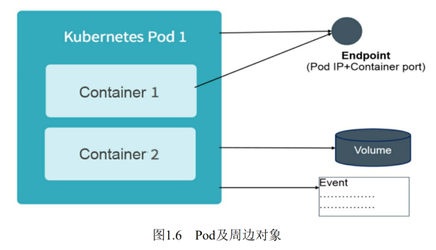
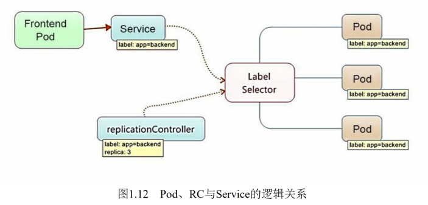
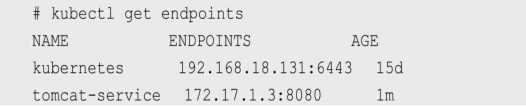
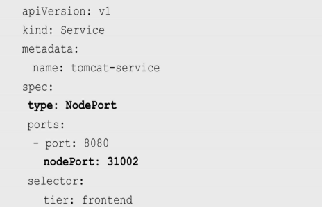
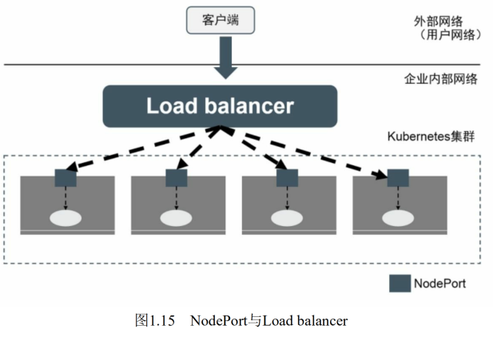
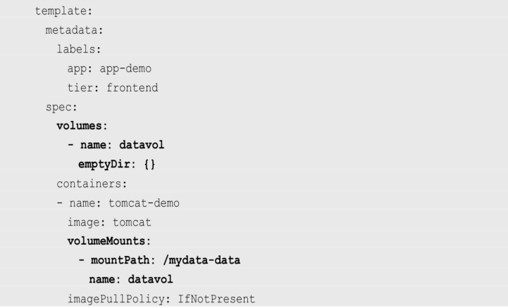
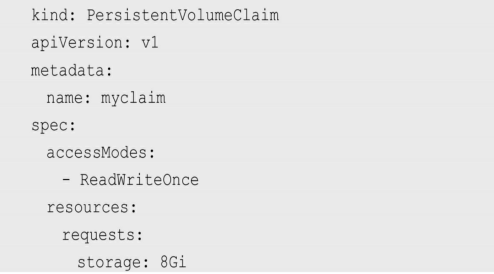
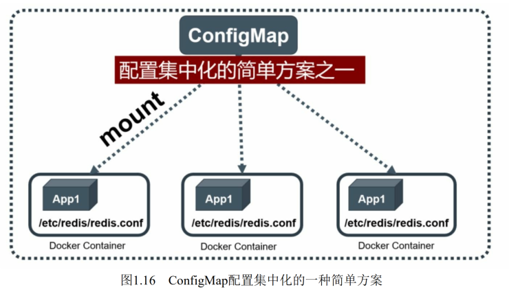

# 概念汇总

## Master

​		Kubernetes里的Master指的是集群控制节点，在每个Kubernetes集群里都需要有一个Master来负责整个集群的管理和控制，基本上 Kubernetes的所有控制命令都发给它，它负责具体的执行过程，我们后 面执行的所有命令基本都是在Master上运行的。Master通常会占据一个独立的服务器（高可用部署建议用3台服务器），主要原因是它太重要了，是整个集群的“首脑”，如果它宕机或者不可用，那么对集群内容器应用的管理都将失效。 

​		在Master上运行着以下关键进程。 

* Kubernetes API Server（kube-apiserver）：提供了HTTP Rest接口的关键服务进程，是Kubernetes里所有资源的增、删、改、查等操作的唯一入口，也是集群控制的入口进程。 
* Kubernetes Controller Manager（kube-controller-manager）： Kubernetes里所有资源对象的自动化控制中心，可以将其理解为资源对象的“大总管”。 
* Kubernetes Scheduler（kube-scheduler）：负责资源调度（Pod调度）的进程，相当于公交公司的“调度室”。 
* 另外，在Master上通常还需要部署etcd服务，因为Kubernetes里的所有资源对象的数据都被保存在etcd中。


## Node

​		与Master一样，Node可以是一台物理主机，也可以是一台虚拟机。Node是Kubernetes集群中的工作负载节点，每个 Node都会被Master分配一些工作负载（Docker容器），当某个Node宕机时，其上的工作负载会被Master自动转移到其他节点上。 

​		在每个Node上都运行着以下关键进程。 

*  kubelet：负责Pod对应的容器的创建、启停等任务，同时与Master密切协作，实现集群管理的基本功能。
* kube-proxy：实现Kubernetes Service的通信与负载均衡机制的重要组件。 
* Docker Engine（docker）：Docker引擎，负责本机的容器创建和管理工作。 

```shell
$ kubectl get nodes
```


## **Pod** 

​		Pod是Kubernetes最重要的基本概念，如图1.4所示是Pod的组成示意图，我们看到每个Pod都有一个特殊的被称为“根容器”的Pause容器。 Pause容器对应的镜像属于Kubernetes平台的一部分，除了Pause容器， 每个Pod还包含一个或多个紧密相关的用户业务容器。 

  


## Label

​		Label（标签）是Kubernetes系统中另外一个核心概念。一个Label是一个key=value的键值对，其中key与value由用户自己指定。Label可以被附加到各种资源对象上，例如Node、Pod、Service、RC等，一个资源对象可以定义任意数量的Label，同一个Label也可以被添加到任意数量的资源对象上。Label通常在资源对象定义时确定，也可以在对象创建后动态添加或者删除。 

​		我们可以通过给指定的资源对象捆绑一个或多个不同的Label来实现多维度的资源分组管理功能，以便灵活、方便地进行资源分配、调度、配置、部署等管理工作。例如，部署不同版本的应用到不同的环境中；监控和分析应用（日志记录、监控、告警）等。一些常用的Label示例如下。 

* 版本标签："release":"stable"、"release":"canary"。 
* 环境标签："environment":"dev"、"environment":"qa"、"environment":"production"。
* 架构标签："tier":"frontend"、"tier":"backend"、"tier":"middleware"。 
* 分区标签："partition":"customerA"、"partition":"customerB"。 
* 质量管控标签："track":"daily"、"track":"weekly"。 

​	可以通过多个Label Selector表达式的组合实现复杂的条件选择，多个表达式之间用“，”进行分隔即可，几个条件之间是“AND”的关系，即同时满足多个条件，比如下面的例子：

```
name=redis-slave,env!=production
name notin (php-frontend),env!=production
```

以myweb Pod为例，Label被定义在其metadata中： 

```yaml
apiVersion: v1
kind: Pod
metadata:
  name: web
  labels:
    app: web
```

管理对象RC和Service则通过Selector字段设置需要关联Pod的 Label：

```yaml
apiVersion: v1
kind: ReplicationController
metadata:
  name: myweb
spec:
  replicas: 1
  selector:
    app: myweb
  template:
  ......

apiVersion: v1
kind: Service
metadata:
  name: myweb
spec:
  selector:
    app: myweb
  ports:
  - port: 8080
```

其他管理对象如Deployment、ReplicaSet、DaemonSet和Job则可以在Selector中使用基于集合的筛选条件定义，例如： 

```yaml
selector:
  matchLables:
    app: web
  matchExpressions:
    - {key: tier, operator: In, values: [frontend]}
    - {key: environmetn, operator: NotIn, value: [dev]}
```

matchLabels用于定义一组Label，与直接写在Selector中的作用相同；matchExpressions用于定义一组基于集合的筛选条件，可用的条件 运算符包括In、NotIn、Exists和DoesNotExist。 

如果同时设置了matchLabels和matchExpressions，则两组条件为AND关系，即需要同时满足所有条件才能完成Selector的筛选。 


Label Selector在Kubernetes中的重要使用场景如下

* kube-controller进程通过在资源对象RC上定义的Label Selector来筛选要监控的Pod副本数量，使Pod副本数量始终符合预期设定的全自动控制流程。 
* kube-proxy进程通过Service的Label Selector来选择对应的Pod， 自动建立每个Service到对应Pod的请求转发路由表，从而实现Service的智能负载均衡机制。
* 通过对某些Node定义特定的Label，并且在Pod定义文件中使用NodeSelector这种标签调度策略，kube-scheduler进程可以实现Pod定向调度的特性。 


## **Replication Controller** 

​		RC是Kubernetes系统中的核心概念之一，简单来说，它其实定义了一个期望的场景，即声明某种Pod的副本数量在任意时刻都符合某个预期值，所以RC的定义包括如下几个部分。 

* Pod期待的副本数量
* 用于筛选目标Pod的Label Selector
* 当Pod的副本数量小于预期数量时，用于创建新Pod的Pod模板（template）


​		下面是一个完整的RC定义的例子，即确保拥有tier=frontend标签的这个Pod（运行Tomcat容器）在整个Kubernetes集群中始终只有一个副本：

```yaml
apiVersion: v1
kind: ReplicationController
metadata:
  name: frontend
spec:
  replicas: 1
  selector:
    tier: frontend
  template:
    metadata:
      labels:
        app: app-demo
        tier: frontend
    spec:
      containers:
      - name: tomcat-demo
        image: tomcat
        imagePullPolicy: IfNotPresent
        env: 
        - name: GET_HOSTS_FROM
          value: dns
        ports:
        - containerPort: 80
```


## **Deployment**

​		Deployment相对于RC的一个最大升级是我们可以随时知道当前Pod“部署”的进度。实际上由于一个Pod的创建、调度、绑定节点及在目标Node上启动对应的容器这一完整过程需要一定的时间，所以我们期待系统启动N个Pod副本的目标状态，实际上是一个连续变化的“部署过程”导致的最终状态。 

​	Deployment的典型使用场景有以下几个

* 创建一个Deployment对象来生成对应的Replica Set并完成Pod副本的创建
* 检查Deployment的状态来看部署动作是否完成（Pod副本数量是否达到预期的值）
* 更新Deployment以创建新的Pod（比如镜像升级）
* 如果当前Deployment不稳定，则回滚到一个早先的Deployment版本
* 暂停Deployment以便于一次性修改多个PodTemplateSpec的配置项，之后再恢复Deployment，进行新的发布
* 扩展Deployment以应对高负载
* 查看Deployment的状态，以此作为发布是否成功的指标
* 清理不再需要的旧版本ReplicaSets


下面通过运行一些例子来直观地感受Deployment的概念。创建一个名为tomcat-deployment.yaml的Deployment描述文件，内容如下：

```yaml
apiVersion: extensions/v1beta1
kind: Deployment
metadata:
  name: frontend
spec:
  replicas: 1
  selector:
    matchLabels:
      tier: frontend
    matchExpressions:
      - {key: tier, operator: In, values: [frontend]}
  template:
    metadata:
      labels:
        app: app-demo
        tier: frontend
      spec:
        containers:
        - name: tomcat-demo
          image: tomcat
          imagePullPolicy: IfNotPresent
          ports:
          - containerPort: 8080
```

对上述输出中涉及的数量解释如下

```shell
$ kubectl get deployments
```


* DESIRED：Pod副本数量的期望值，即在Deployment里定义的Replica
* CURRENT：当前Replica的值，实际上是Deployment创建的Replica Set里的Replica值，这个值不断增加，直到达到DESIRED为止，表明整个部署过程完成
* UP-TO-DATE：最新版本的Pod的副本数量，用于指示在滚动升级的过程中，有多少个Pod副本已经成功升级
* AVAILABLE：当前集群中可用的Pod副本数量，即集群中当前存活的Pod数量

运行下述命令查看对应的Replica Set，我们看到它的命名与Deployment的名称有关系： 

```shell
$ kubectl get rs
```


## **Horizontal Pod Autoscaler**  TODO，补充第二章知识

​		Horizontal Pod Autoscaling（Pod横向自动扩容，HPA）

HPA与之前的RC、Deployment一样，也属于一种Kubernetes资源对象。通过追踪分析指定RC控制的所有目标Pod的负载变化情况，来确定是否需要有针对性地调整目标Pod的副本数量，这是HPA的实现原理。 当前，HPA有以下两种方式作为Pod负载的度量指标

* CPUUtilizationPercentage
* 应用程序自定义的度量指标，比如服务在每秒内的相应请求数（TPS或QPS）


​		CPUUtilizationPercentage是一个算术平均值，即目标Pod所有副本自身的CPU利用率的平均值。一个Pod自身的CPU利用率是该Pod当前CPU的使用量除以它的Pod Request的值，比如定义一个Pod的Pod Request为0.4，而当前Pod的CPU使用量为0.2，则它的CPU使用率为50%，这样就可以算出一个RC控制的所有Pod副本的CPU利用率的算术平均值了。如果某一时刻CPUUtilizationPercentage的值超过80%，则意味着当前Pod副本数量很可能不足以支撑接下来更多的请求，需要进行动态扩容，而在请求高峰时段过去后，Pod的CPU利用率又会降下来，此时对应的Pod副本数应该自动减少到一个合理的水平。如果目标Pod没有定义Pod Request的值，则无法使用CPUUtilizationPercentage实现Pod横向自动扩容。除了使用CPUUtilizationPercentage，Kubernetes从1.2版本开始也在 尝试支持应用程序自定义的度量指标

下面是HPA定义的一个具体例子：

```yaml
apiVersion: autoscaling/v1
kind: HorizontalPodAutoscaler
metadata:
  name: php-apache
  namespace: default
spec:
  maxReplicas: 10
  minReplicas: 1
  scaleTargetRef:
    kind: Deployment
    name: php-apache
  targetCPUUtilizationPercentage: 90
```

​		根据上面的定义，我们可以知道这个HPA控制的目标对象为一个名为php-apache的Deployment里的Pod副本，当这些Pod副本的 CPUUtilizationPercentage的值超过90%时会触发自动动态扩容行为，在扩容或缩容时必须满足的一个约束条件是Pod的副本数为1～10

​		除了可以通过直接定义YAML文件并且调用kubectrl create的命令来创建一个HPA资源对象的方式，还可以通过下面的简单命令行直接创建等价的HPA对象：

```shell
$ kubectl autoscale deployment php-apache --cpu-percent=90 --min=1 --max=10
```


## **StatefulSet**

​		在Kubernetes系统中，Pod的管理对象RC、Deployment、DaemonSet和Job都面向无状态的服务。但现实中有很多服务是有状态的，特别是一些复杂的中间件集群，例如MySQL集群、MongoDB集群、kafka集群、ZooKeeper集群等，这些应用集群有4个共同点

* 每个节点都有固定的身份ID，通过这个ID，集群中的成员可以相互发现并通信
* 集群的规模是比较固定的，集群规模不能随意变动
* 集群中的每个节点都是有状态的，通常会持久化数据到永久存储中
* 如果磁盘损坏，则集群里的某个节点无法正常运行，集群功能受损


StatefulSet特性

* StatefulSet里的每个Pod都有稳定、唯一的网络标识，可以用来发现集群内的其他成员。假设StatefulSet的名称为kafka，那么第1个Pod叫kafka-0，第2个叫kafka-1，以此类推
* StatefulSet控制的Pod副本的启停顺序是受控的，操作第n个Pod时，前n-1个Pod已经是运行且准备好的状态
* StatefulSet里的Pod采用稳定的持久化存储卷，通过PV或PVC来实现，删除Pod时默认不会删除与StatefulSet相关的存储卷（为了保证数据的安全）

StatefulSet除了要与PV卷捆绑使用以存储Pod的状态数据，还要与Headless Service配合使用，即在每个StatefulSet定义中都要声明它属于 哪个Headless Service。Headless Service与普通Service的关键区别在于， 它没有Cluster IP，如果解析Headless Service的DNS域名，则返回的是该 Service对应的全部Pod的Endpoint列表。StatefulSet在Headless Service的 基础上又为StatefulSet控制的每个Pod实例都创建了一个DNS域名，这个 域名的格式为： 

```
$(podname).$(headless service name)
```

比如一个3节点的Kafka的StatefulSet集群对应的Headless Service的名称为kafka，StatefulSet的名称为kafka，则StatefulSet里的3个Pod的DNS 名称分别为kafka-0.kafka、kafka-1.kafka、kafka-3.kafka，这些DNS名称可以直接在集群的配置文件中固定下来


## **Service** 

### service介绍

​		Service服务也是Kubernetes里的核心资源对象之一，Kubernetes里的每个Service其实就是我们经常提起的微服务架构中的一个微服务，之前讲解Pod、RC等资源对象其实都是为讲解Kubernetes Service做铺垫的

​		图1.12显示了Pod、RC与Service的逻辑关系

 

​		从图1.12中可以看到，Kubernetes的Service定义了一个服务的访问入口地址，前端的应用（Pod）通过这个入口地址访问其背后的一组由 Pod副本组成的集群实例，Service与其后端Pod副本集群之间则是通过 Label Selector来实现无缝对接的。RC的作用实际上是保证Service的服务能力和服务质量始终符合预期标准


​		每个Pod都会被分配一个单独的IP地址，而且每个Pod都提供了 一个独立的Endpoint（Pod IP+ContainerPort）以被客户端访问，现在多 个Pod副本组成了一个集群来提供服务，那么客户端如何来访问它们 呢？一般的做法是部署一个负载均衡器（软件或硬件），为这组Pod开 启一个对外的服务端口如8000端口，并且将这些Pod的Endpoint列表加 入8000端口的转发列表，客户端就可以通过负载均衡器的对外IP地址 +服务端口来访问此服务。客户端的请求最后会被转发到哪个Pod，由负 载均衡器的算法所决定。 

​		Kubernetes也遵循上述常规做法，运行在每个Node上的kube-proxy 进程其实就是一个智能的软件负载均衡器，负责把对Service的请求转发 到后端的某个Pod实例上，并在内部实现服务的负载均衡与会话保持机 制。但Kubernetes发明了一种很巧妙又影响深远的设计：Service没有共 用一个负载均衡器的IP地址，每个Service都被分配了一个全局唯一的虚 拟IP地址，这个虚拟IP被称为Cluster IP。这样一来，每个服务就变成了 具备唯一IP地址的通信节点，服务调用就变成了最基础的TCP网络通信问题

​		我们知道，Pod的Endpoint地址会随着Pod的销毁和重新创建而发生 改变，因为新Pod的IP地址与之前旧Pod的不同。而Service一旦被创建，Kubernetes就会自动为它分配一个可用的Cluster IP，而且在Service的整 个生命周期内，它的Cluster IP不会发生改变。于是，服务发现这个棘手 的问题在Kubernetes的架构里也得以轻松解决：只要用Service的Name与 Service的Cluster IP地址做一个DNS域名映射即可完美解决问题。现在想 想，这真是一个很棒的设计

​		创建一个Service来加深对它的理解。创建一 个名为tomcat-service.yaml的定义文件，内容如下：

```yaml
apiVersion: v1
kind: Service
metadata:
  name: tomcat-service
psec:
  ports:
  - port: 8080
  spector:
    tier: frontend
```

上述内容定义了一个名为tomcat-service的Service，它的服务端口为 8080，拥有“tier=frontend”这个Label的所有Pod实例都属于它，运行下面 的命令进行创建： 

```shell
$ kubectl create -f tomcat-service.yaml
```

​		我们之前在tomcat-deployment.yaml里定义的Tomcat的Pod刚好拥有 这个标签，所以刚才创建的tomcat-service已经对应一个Pod实例，运行 下面的命令可以查看tomcatservice的Endpoint列表，其中172.17.1.3是Pod 的IP地址，端口8080是Container暴露的端口：

```shell
$ kubectl get endpoints
```

 

你可能有疑问：“说好的Service的Cluster IP呢？怎么没有看到？”运行下面的命令即可看到tomct-service被分配的Cluster IP及更多的信息：

 

​		在spec.ports的定义中，targetPort属性用来确定提供该服务的容器所暴露（EXPOSE）的端口号，即具体业务进程在容器内的targetPort上提供TCP/IP接入；port属性则定义了Service的虚端口。前面定义Tomcat服务时没有指定targetPort，则默认targetPort与port相同


​		接下来看看Service的多端口问题。

​		很多服务都存在多个端口的问题，通常一个端口提供业务服务，另外一个端口提供管理服务，比如Mycat、Codis等常见中间件。 Kubernetes Service支持多个Endpoint，在存在多个Endpoint的情况下，要求每个Endpoint都定义一个名称来区分。下面是Tomcat多端口的Service 定义样例： 

```yaml
apiVersion: v1
kind: Service
metadata:
  name: tomcat-service
spec:
  ports:
  - port: 8080
    name: service-port
  - port: 8005
    name: shutdown-port
  selector:
    tier: frontend
```

多端口为什么需要给每个端口都命名呢？这就涉及Kubernetes的服务发现机制了，接下来进行讲解


### k8s的服务发现机制

​		每个Kubernetes中的Service都有唯一的Cluster IP及唯一的名称，而名称是由开发者自己定义的，部署时也没必要改变，所以完全可 以被固定在配置中。接下来的问题就是如何通过Service的名称找到对应的Cluster IP

​		最早时Kubernetes采用了Linux环境变量解决这个问题，即每个Service都生成一些对应的Linux环境变量（ENV），并在每个Pod的容器启动时自动注入这些环境变量。以下是tomcat-service产生的环境变量条目：

  

​		在上述环境变量中，比较重要的是前3个环境变量。可以看到，每个Service的IP地址及端口都有标准的命名规范，遵循这个命名规范，就 可以通过代码访问系统环境变量来得到所需的信息，实现服务调用

​		考虑到通过环境变量获取Service地址的方式仍然不太方便、不够直观，后来Kubernetes通过Add-On增值包引入了DNS系统，把服务名作为DNS域名，这样程序就可以直接使用服务名来建立通信连接了。目前， Kubernetes上的大部分应用都已经采用了DNS这种新兴的服务发现机制，后面会讲解如何部署DNS系统

### 外部系统访问**Service**的问题

为了更深入地理解和掌握Kubernetes，我们需要弄明白Kubernetes里 的3种IP，这3种IP分别如下

* Node IP：Node的IP地址
* Pod IP：Pod的IP地址
* Cluster IP：Service的IP地址


​		首先，Node IP是Kubernetes集群中每个节点的物理网卡的IP地址， 是一个真实存在的物理网络，所有属于这个网络的服务器都能通过这个网络直接通信，不管其中是否有部分节点不属于这个Kubernetes集群。 这也表明在Kubernetes集群之外的节点访问Kubernetes集群之内的某个节点或者TCP/IP服务时，都必须通过Node IP通信

​		其次，Pod IP是每个Pod的IP地址，它是Docker Engine根据docker0 网桥的IP地址段进行分配的，通常是一个虚拟的二层网络，前面说过， Kubernetes要求位于不同Node上的Pod都能够彼此直接通信，所以 Kubernetes里一个Pod里的容器访问另外一个Pod里的容器时，就是通过 Pod IP所在的虚拟二层网络进行通信的，而真实的TCP/IP流量是通过 Node IP所在的物理网卡流出的

​		最后说说Service的Cluster IP，它也是一种虚拟的IP，但更像一个“伪造”的IP网络，原因有以下几点

* Cluster IP仅仅作用于Kubernetes Service这个对象，并由 Kubernetes管理和分配IP地址（来源于Cluster IP地址池）
* Cluster IP无法被Ping，因为没有一个“实体网络对象”来响应
* Cluster IP只能结合Service Port组成一个具体的通信端口，单独 的Cluster IP不具备TCP/IP通信的基础，并且它们属于Kubernetes集群这 样一个封闭的空间，集群外的节点如果要访问这个通信端口，则需要做 一些额外的工作
* 在Kubernetes集群内，Node IP网、Pod IP网与Cluster IP网之间的通信，采用的是Kubernetes自己设计的一种编程方式的特殊路由规 则，与我们熟知的IP路由有很大的不同


​		根据上面的分析和总结，我们基本明白了：Service的Cluster IP属于 Kubernetes集群内部的地址，无法在集群外部直接使用这个地址。那么 矛盾来了：实际上在我们开发的业务系统中肯定多少有一部分服务是要提供给Kubernetes集群外部的应用或者用户来使用的，典型的例子就是 Web端的服务模块，比如上面的tomcat-service，那么用户怎么访问它？

​		采用NodePort是解决上述问题的最直接、有效的常见做法。以 tomcat-service为例，在Service的定义里做如下扩展即可（见代码中的粗 体部分）： 

​	

其中，nodePort:31002这个属性表明手动指定tomcat-service的NodePort为31002，否则Kubernetes会自动分配一个可用的端口。接下来 在浏览器里访问http://<nodePortIP>:31002/，就可以看到Tomcat的欢迎界面了

NodePort的实现方式是在Kubernetes集群里的每个Node上都为需要外部访问的Service开启一个对应的TCP监听端口，外部系统只要用任意一个Node的IP地址+具体的NodePort端口号即可访问此服务，在任意Node上运行netstat命令，就可以看到有NodePort端口被监听： 

 


​		但NodePort还没有完全解决外部访问Service的所有问题，比如负载均衡问题。假如在我们的集群中有10个Node，则此时最好有一个负载均衡器，外部的请求只需访问此负载均衡器的IP地址，由负载均衡器负责转发流量到后面某个Node的NodePort上，如图1.15所示

  

​		图1.15中的Load balancer组件独立于Kubernetes集群之外，通常是一个硬件的负载均衡器，或者是以软件方式实现的，例如HAProxy或者 Nginx。对于每个Service，我们通常需要配置一个对应的Load balancer实例来转发流量到后端的Node上，这的确增加了工作量及出错的概率。于是Kubernetes提供了自动化的解决方案，如果我们的集群运行在谷歌的公有云GCE上，那么只要把Service的type=NodePort改为 type=LoadBalancer，Kubernetes就会自动创建一个对应的Load balancer实例并返回它的IP地址供外部客户端使用。其他公有云提供商只要实现了支持此特性的驱动，则也可以达到上述目的。此外，裸机上的类似机制 （Bare Metal Service Load Balancers）也在被开发


## **Job** 

​		我们可以通过Kubernetes Job这种新的资源对象定义并启动一个批处理任务Job。与RC、 Deployment、ReplicaSet、DaemonSet类似，Job也控制一组Pod容器。从 这个角度来看，Job也是一种特殊的Pod副本自动控制器，同时Job控制 Pod副本与RC等控制器的工作机制有以下重要差别

​		（1）Job所控制的Pod副本是短暂运行的，可以将其视为一组 Docker容器，其中的每个Docker容器都仅仅运行一次。当Job控制的所有Pod副本都运行结束时，对应的Job也就结束了。Job在实现方式上与 RC等副本控制器不同，Job生成的Pod副本是不能自动重启的，对应Pod 副本的RestartPoliy都被设置为Never。因此，当对应的Pod副本都执行完 成时，相应的Job也就完成了控制使命，即Job生成的Pod在Kubernetes中 是短暂存在的。Kubernetes在1.5版本之后又提供了类似crontab的定时任 务——CronJob，解决了某些批处理任务需要定时反复执行的问题。

​		（2）Job所控制的Pod副本的工作模式能够多实例并行计算，以TensorFlow框架为例，可以将一个机器学习的计算任务分布到10台机器上，在每台机器上都运行一个worker执行计算任务，这很适合通过Job生成10个Pod副本同时启动运算


## **Volume** 

​		Volume（存储卷）是Pod中能够被多个容器访问的共享目录。 Kubernetes的Volume概念、用途和目的与Docker的Volume比较类似，但 两者不能等价。首先，Kubernetes中的Volume被定义在Pod上，然后被 一个Pod里的多个容器挂载到具体的文件目录下；其次，Kubernetes中的 Volume与Pod的生命周期相同，但与容器的生命周期不相关，当容器终 止或者重启时，Volume中的数据也不会丢失。最后，Kubernetes支持多种类型的Volume，例如GlusterFS、Ceph等先进的分布式文件系统

​		Volume的使用也比较简单，在大多数情况下，我们先在Pod上声明 一个Volume，然后在容器里引用该Volume并挂载（Mount）到容器里的 某个目录上。举例来说，我们要给之前的Tomcat Pod增加一个名为 datavol的Volume，并且挂载到容器的/mydata-data目录上，则只要对Pod 的定义文件做如下修正即可（注意代码中的粗体部分）：

 


## **Persistent Volume** 

​		之前提到的Volume是被定义在Pod上的，属于计算资源的一部分， 而实际上，网络存储是相对独立于计算资源而存在的一种实体资源。比 如在使用虚拟机的情况下，我们通常会先定义一个网络存储，然后从中 划出一个“网盘”并挂接到虚拟机上。Persistent Volume（PV）和与之相 关联的Persistent Volume Claim（PVC）也起到了类似的作用

​		PV可以被理解成Kubernetes集群中的某个网络存储对应的一块存储，它与Volume类似，但有以下区别

* PV只能是网络存储，不属于任何Node，但可以在每个Node上访问

* PV并不是被定义在Pod上的，而是独立于Pod之外定义的

* PV目前支持的类型包括：gcePersistentDisk、 AWSElasticBlockStore、AzureFile、AzureDisk、FC（Fibre Channel）、 

  Flocker、NFS、iSCSI、RBD（Rados Block Device）、CephFS、 Cinder、GlusterFS、VsphereVolume、Quobyte Volumes、VMware Photon、Portworx Volumes、ScaleIO Volumes和HostPath（仅供单机测 试）

下面给出了NFS类型的PV的一个YAML定义文件，声明了需要5Gi 的存储空间： 

 

比较重要的是PV的accessModes属性，目前有以下类型。 

◎ ReadWriteOnce：读写权限，并且只能被单个Node挂载。 

◎ ReadOnlyMany：只读权限，允许被多个Node挂载。 

◎ ReadWriteMany：读写权限，允许被多个Node挂载。 


如果某个Pod想申请某种类型的PV，则首先需要定义一个 PersistentVolumeClaim对象：

 

然后，在Pod的Volume定义中引用上述PVC即可：

 

最后说说PV的状态。PV是有状态的对象，它的状态有以下几种。 

◎ Available：空闲状态。 

◎ Bound：已经绑定到某个PVC上。 

◎ Released：对应的PVC已经被删除，但资源还没有被集群收 回。

◎ Failed：PV自动回收失败。 


## **Namespace** 

​		Namespace（命名空间）是Kubernetes系统中的另一个非常重要的概念，Namespace在很多情况下用于实现多租户的资源隔离。Namespace 通过将集群内部的资源对象“分配”到不同的Namespace中，形成逻辑上分组的不同项目、小组或用户组，便于不同的分组在共享使用整个集群的资源的同时还能被分别管理

​		Kubernetes集群在启动后会创建一个名为default的Namespace，通过kubectl可以查看： 

 

​		


## **Annotation** 

​		Annotation（注解）与Label类似，也使用key/value键值对的形式进行定义。不同的是Label具有严格的命名规则，它定义的是Kubernetes对象的元数据（Metadata），并且用于Label Selector。Annotation则是用户 任意定义的附加信息，以便于外部工具查找。在很多时候，Kubernetes的模块自身会通过Annotation标记资源对象的一些特殊信息

​		通常来说，用Annotation来记录的信息如下

* build信息、release信息、Docker镜像信息等，例如时间戳、 release id号、PR号、镜像Hash值、Docker Registry地址等
* 日志库、监控库、分析库等资源库的地址信息
* 程序调试工具信息，例如工具名称、版本号等
*  团队的联系信息，例如电话号码、负责人名称、网址等


## **ConfigMap** 

​		为了能够准确和深刻理解Kubernetes ConfigMap的功能和价值，我们需要从Docker说起。我们知道，Docker通过将程序、依赖库、数据及配置文件“打包固化”到一个不变的镜像文件中的做法，解决了应用的部署的难题，但这同时带来了棘手的问题，即配置文件中的参数在运行期如何修改的问题。我们不可能在启动Docker容器后再修改容器里的配置文件，然后用新的配置文件重启容器里的用户主进程。为了解决这个问题，Docker提供了两种方式：

* 在运行时通过容器的环境变量来传递参数
* 通过Docker Volume将容器外的配置文件映射到容器内


​		这两种方式都有其优势和缺点，在大多数情况下，后一种方式更合适我们的系统，因为大多数应用通常从一个或多个配置文件中读取参数。但这种方式也有明显的缺陷：我们必须在目标主机上先创建好对应的配置文件，然后才能映射到容器里

​		k8s设计：

​		首先，把所有的配置项都当作key-value字符串，当然value可以来自 某个文本文件，比如配置项password=123456、user=root、 host=192.168.8.4用于表示连接FTP服务器的配置参数。这些配置项可以 作为Map表中的一个项，整个Map的数据可以被持久化存储在 Kubernetes的Etcd数据库中，然后提供API以方便Kubernetes相关组件或客户应用CRUD操作这些数据，上述专门用来保存配置参数的Map就是Kubernetes ConfigMap资源对象

​		接下来，Kubernetes提供了一种内建机制，将存储在etcd中的ConfigMap通过Volume映射的方式变成目标Pod内的配置文件，不管目 标Pod被调度到哪台服务器上，都会完成自动映射。进一步地，如果ConfigMap中的key-value数据被修改，则映射到Pod中的“配置文件”也会随之自动更新。于是，Kubernetes ConfigMap就成了分布式系统中最为简单（使用方法简单，但背后实现比较复杂）且对应用无侵入的配置中心

 