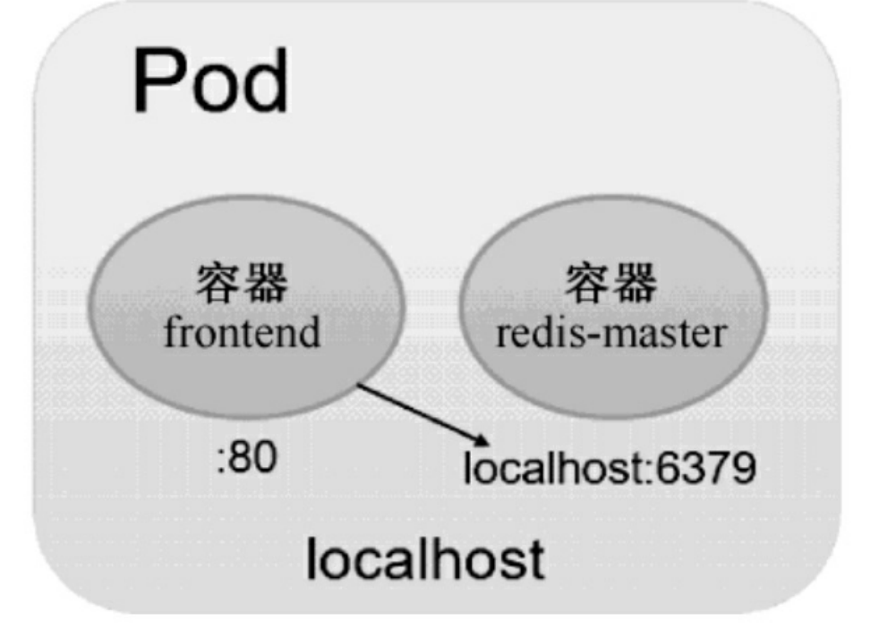
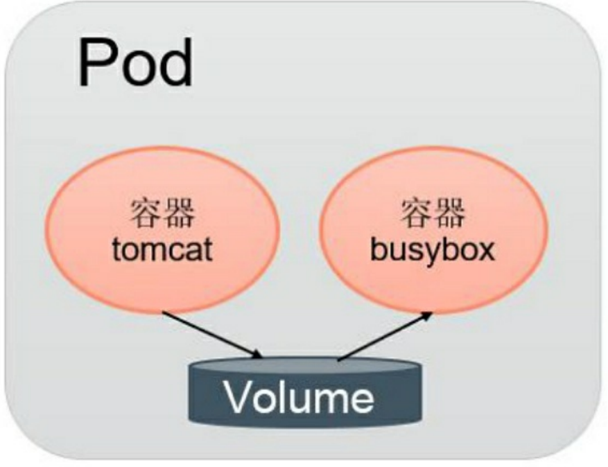

# 深入理解Pod

## Pod定义详解

### YAML格式

```yaml
apiVersion: apps/v1
kind: Deployment
metadata:
  name: string
  namespace: string
  labels:
    app: string
  annotations:
    - name: string
spec:
  containers:
    - name: string 
    - image: nginx:1.15.2
      imagePullPolicy: [Always | Never | IfNotPresent]
      command: [string]
      args: [string]
      workingDir: string
      volumeMounts:
      - name: string
        mountPath: string
        readOnly: boolean
      ports:
      - name: string
        containerPort: int
        hostPort: int
        protocol: string
      env:
      - name: string
        value: string
      resources:
        limits:
          cpu: string
          memory: string
        requests:
          cpu: string
          memory: string
      livenessProbe:
        exec:
          command: [string]
        httpGet:
          path: string
          port: number
          host: string
          scheme: string
          httpHeaders:
          - name: string
            value: string
        tcpSocket:
          port: number
        initialDelaySeconds: 0
        timeoutSeconds: 0
        periodSeconds: 0
        successThreshold: 0
        failureThreshold: 0
      securityContext:
        privileged: false
      restartPolicy: [Always | Never | OnFailure]
      nodeSelector: object
      imagePullSecrets:
      - name: string
      hostNetwork: false
      volumes:
      - name: string
        emptyDir: {}
        hostPath:
          path: string
        secret:
          secretName: string
          items:
          - key: string
            path: string
        configMap:
         name: string
         items:
         - key: string
           path: string
        
```


### 属性介绍

| 属性名称                                         | 取值类型 | 是否必选 | 取值说明                                                     |
| ------------------------------------------------ | -------- | -------- | ------------------------------------------------------------ |
| version                                          | String   | Required | 版本号，例如v1                                               |
| kind                                             | String   | Required | Pod                                                          |
| metadata                                         | Object   | Required | 元数据                                                       |
| metadata.name                                    | String   | Required | Pod的名称                                                    |
| metadata.namespace                               | String   | Required | Pod所属的命名空间，默认default                               |
| metadata.labels[]                                | List     |          | 自定义标签列表                                               |
| metadata.annotation[]                            | List     |          | 自定义注解列表                                               |
| spec                                             | Object   | Required | Pod中容器的详细定义                                          |
| spec.containers[]                                | List     | Required | Pod中的容器列表                                              |
| spec.containers[].name                           | String   | Required | 容器的名称                                                   |
| spec.containers[].image                          | String   | Required | 容器的镜像名称                                               |
| spec.containers[].imagePullPolicy                | String   |          | 镜像拉取策略;<br />Always: 每次拉取镜像<br />Never: 仅使用本地镜像<br />IfNotPresent：本地有镜像使用本地，没有拉取镜像 |
| spec.containers[].command[]                      | List     |          | 容器的启动命令列表，如果不指定，则使用镜像打包时使用的启动命令 |
| spec.containers[].args[]                         | List     |          | 容器的启动命令参数列表                                       |
| spec.containers[].workingDir                     | String   |          | 容器的工作目录                                               |
| spec.containers[].volumeMounts[]                 | List     |          | 挂载到容器内部的存储卷配置                                   |
| spec.containers[].volumeMounts[].name            | String   |          | 引用Pod定义的共享存储卷的名称，需使用volumes[]部分定义的共享存储卷名称 |
| spec.containers[].volumeMounts[].mountPath       | String   |          | 存储卷在容器内Mount的绝对路径                                |
| spec.containers[].volumeMounts[].readOnly        | Boolean  |          | 是否为只读模式，默认为读写模式                               |
| spec.containers[].ports[]                        | List     |          | 容器需要暴露的端口列表                                       |
| spec.containers[].ports[].name                   | String   |          | 端口的名称                                                   |
| spec.containers[].ports[].containerPort          | Int      |          | 容器需要监听的端口号                                         |
| spec.containers[].ports[].hostPort               | Int      |          | 容器所在主机需要监听的端口号，默认和containerPort相同。设置hostPort时，同一台宿主机无法启动该容器的第2份副本 |
| spec.containers[].ports[].protocol               | String   |          | 端口协议，支持TCP和UDP，默认TCP                              |
| spec.containers[].env[]                          | List     |          | 容器运行前需设置的环境变量列表                               |
| spec.containers[].env[].name                     | String   |          | 环境变量的名称                                               |
| spec.containers[].env[].value                    | String   |          | 环境变量的值                                                 |
| spec.containers[].resources                      | Object   |          | 资源限制和资源请求的设置                                     |
| spec.containers[].resources.limits               | Object   |          | 资源限制的设置                                               |
| spec.containers[].resources.cpu                  | String   |          | CPU限制，单位为core数，将用于docker run --cpu-shares参数     |
| spec.containers[].resources.memory               | String   |          | 内存限制，单位可以是MiB、GiB等，将用于docker run --memory参数 |
| spec.containers[].resources.requests             | Object   |          | 资源限制的设置                                               |
| spec.containers[].resources.requests.cpu         | String   |          | CPU请求，单位为core数，容器启动的初始可用数量                |
| spec.containers[].resources.requests.memory      | String   |          | 内存请求，单位可以是MiB、GiB等，容器启动的初始可用数量       |
| spec.volumes[]                                   | List     |          | 在该Pod上定义的共享存储卷列表                                |
| spec.volumes[].name                              | String   |          | 共享存储卷的名称，在一个Pod中每个存储定义一个名称。容器定义部分的containers[].volumeMounts[].name 将引用改存储卷的名称。<br />Volume的类型包括：emptyDir、hostPath、secret、configMap等 |
| spec.volumes[].emptyDir                          | Object   |          | 类型为emptyDir的存储卷，表示和Pod同生命周期的一个临时目录，其值为一个空对象：emptyDir:{} |
| spec.volumes[].hostPath                          | Object   |          | 类型为hostPath的存储卷，表示挂载Pod所在宿主机的目录，通过volumes[].hostPath.path指定 |
| spec.volumes[].hostPath.path                     | String   |          | Pod所在主机的目录，将被用于容器中的mount的目录               |
| spec.volumes[].secret                            | Object   |          | 类型为secret的存储卷，表示挂载集群预定义的secret对象到容器内部 |
| spec.volumes[].configMap                         | Object   |          | 类型为configMap的存储卷，表示集群预定义的configMap对象到容器内部 |
| spec.volumes[].livenessProbe                     | Object   |          | 对Pod内各容器健康检查的设置，当探测无响应几次之后，系统将自动重启该容器。可以设置的方法包括：exec、httpGet和tcpSocket。对一个容器仅需要设置一种健康检查方法 |
| spec.volumes[].livenessProbe.exec                | Object   |          | 对Pod内各容器健康检查的设置，exec方式                        |
| spec.volumes[].livenessProbe.exec.command[]      | String   |          | exec方式需要指定的命令或者脚本                               |
| spec.volumes[].livenessProbe.httpGet             | Object   |          | 对Pod内各容器健康检查的设置，httpGet方式。需要指定path、port |
| spec.volumes[].livenessProbe.tcpSocket           | Object   |          | 对Pod内各容器健康检查的设置，tcpSocket方式                   |
| spec.volumes[].livenessProbe.initialDelaySeconds | Number   |          | 容器启动完成后首次探测的世时间，单位为s                      |
| spec.volumes[].livenessProbe.timeoutSeconds      | Number   |          | 对容器健康检查的探测等待响应的超时时间设置，单位是s,默认值是1s。若超过该超时时间设置，则将认为该容器不健康，会重启 |
| spec.volumes[].livenessProbe.periodSeconds       | Number   |          | 对容器健康检查的定期探测时间设置，单位为s，默认10s探测一次   |
| spec.restartPolicy                               | String   |          | Pod的重启策略。<br />Always: pod一旦终止运行，则无论容器是如何终止的，kubelet都将重启他<br />OnFailure: 只有Pod以非0退出码终止时，kubelet才会重启。如果容器是正常结束（退出码为0），则Kubelet不会重启它。<br />Never: Pod终止后，kubelete将退出码报告给Master，不会再重启该Pod |
| spec.nodeSelector                                | Object   |          | 设置Node的Label，以key:value格式指定，Pod将被调度到具有这些Label的Node上 |
| spec.imagePullSecrets                            | Object   |          | pull镜像时使用的Secret名称，以name:secretkey格式指定         |
| spec.hostNetwork                                 | Boolean  |          | 是否使用主机网路模式，默认值是false。设置为true表示容器使用主机网路，不再使用Docker网桥，该Pod将无法在同一台宿主机启动第2个副本。 |


## Pod的基本用法

这个 frontend Pod启动之后，将启动一个Docker容器

```yaml
apiVersion: v1
kind: Pod
metadata:
  name: frontend
  labels:
    name: frontend
spec:
  containers:
  - name: frontend
    image: kubeguide/guestbook-php-frontend
    env:
    - name: GET_HOST_FROM
      value: env
    ports:
    - containerPort: 80
```


在一个Pod中，启动多个容器

 

frontend-localredis-pod.yaml

```yaml
apiVersion: v1
kind: Pod
metadata:
  name: redis-php
  labels:
    name: redis-php
spec:
  containers:
  - name: frontend
    image: kubeguide/guestbook-php-frontend:localredis
    ports:
    - containerPort: 80
  - name: redis
    image: kubeguide/redis-master
    ports:
    - containerPort: 6379
```

运行命令创建Pod

```shell
$ kubectl create -f frontend-localredis-pod.yaml
```

查看已经创建的Pod

```shell
$ kubectl get pods
redis-php                2/2     Running   0          2m37s
```

使用 describe， 可以查看是创建了两个容器

```shell
$ kubectl describe pod redis-php

```


## Pod容器共享Volume

 

Pod中多个容器共享Volume 

pod-volume-applogs.yaml

```yaml
apiVersion: v1
kind: Pod
metadata:
  name: volume-pod
spec:
  containers:
  - name: tomcat
    image: tomcat
    ports:
    - containerPort: 8080
    volumeMounts:
    - name: app-logs
      mountPath: /usr/local/tomcat/logs
  - name: busybox
    image: busybox
    command: ["sh", "-c", "tail -f /logs/catalina*.log"]
    volumeMounts:
    - name: app-logs
      mountPath: /logs
  volumes:
  - name: app-logs
    emptyDir: {}
```

例子中，在Pod内包含两个容器：tomcat和busybox，在 Pod级别设置Volume“app-logs”，用于tomcat向其中写日志文件， busybox读日志文件。 

这里设置的Volume名为app-logs，类型为emptyDir,），挂载到tomcat容器内 的/usr/local/tomcat/logs目录，同时挂载到logreader容器内的/logs目录。 

tomcat容器在启动后会向/usr/local/tomcat/logs目录写文件，logreader容器就可以读取其中的文件了。 

```shell
$ kubectl create -f pod-volume-applogs.yaml

```

logreader容器的启动命令为 tail -f /logs/catalina*.log，可以通过 kubectl logs 命令查看

```shell
$ kubectl logs volume-pod -c busybox
13-Jul-2021 08:48:37.906 INFO [main] org.apache.catalina.core.AprLifecycleListener.lifecycleEvent Loaded Apache Tomcat Native library [1.2.30] using APR version [1.6.5].
13-Jul-2021 08:48:37.907 INFO [main] org.apache.catalina.core.AprLifecycleListener.lifecycleEvent APR capabilities: IPv6 [true], sendfile [true], accept filters [false], random [true], UDS [true].
13-Jul-2021 08:48:37.907 INFO [main] org.apache.catalina.core.AprLifecycleListener.lifecycleEvent APR/OpenSSL configuration: useAprConnector [false], useOpenSSL [true]
13-Jul-2021 08:48:37.912 INFO [main] org.apache.catalina.core.AprLifecycleListener.initializeSSL OpenSSL successfully initialized [OpenSSL 1.1.1d  10 Sep 2019]
13-Jul-2021 08:48:38.496 INFO [main] org.apache.coyote.AbstractProtocol.init Initializing ProtocolHandler ["http-nio-8080"]
13-Jul-2021 08:48:38.565 INFO [main] org.apache.catalina.startup.Catalina.load Server initialization in [1074] milliseconds
13-Jul-2021 08:48:38.694 INFO [main] org.apache.catalina.core.StandardService.startInternal Starting service [Catalina]
13-Jul-2021 08:48:38.695 INFO [main] org.apache.catalina.core.StandardEngine.startInternal Starting Servlet engine: [Apache Tomcat/9.0.50]
13-Jul-2021 08:48:38.713 INFO [main] org.apache.coyote.AbstractProtocol.start Starting ProtocolHandler ["http-nio-8080"]
13-Jul-2021 08:48:38.746 INFO [main] org.apache.catalina.startup.Catalina.start Server startup in [179] milliseconds

```

这个文件为tomcat生成的日志文件/usr/local/tomcat/logs/catalina. 

<date>.log的内容。登录tomcat容器进行查看：

```shell
$ kubectl exec -it volume-pod -c tomcat -- ls /usr/local/tomcat/logs
catalina.2021-07-13.log      localhost_access_log.2021-07-13.txt
host-manager.2021-07-13.log  manager.2021-07-13.log
localhost.2021-07-13.log

$ kubectl exec -it volume-pod -c tomcat -- tail /usr/local/tomcat/logs/catalina.2021-07-13.log
13-Jul-2021 08:48:37.906 INFO [main] org.apache.catalina.core.AprLifecycleListener.lifecycleEvent Loaded Apache Tomcat Native library [1.2.30] using APR version [1.6.5].
13-Jul-2021 08:48:37.907 INFO [main] org.apache.catalina.core.AprLifecycleListener.lifecycleEvent APR capabilities: IPv6 [true], sendfile [true], accept filters [false], random [true], UDS [true].
13-Jul-2021 08:48:37.907 INFO [main] org.apache.catalina.core.AprLifecycleListener.lifecycleEvent APR/OpenSSL configuration: useAprConnector [false], useOpenSSL [true]
13-Jul-2021 08:48:37.912 INFO [main] org.apache.catalina.core.AprLifecycleListener.initializeSSL OpenSSL successfully initialized [OpenSSL 1.1.1d  10 Sep 2019]
13-Jul-2021 08:48:38.496 INFO [main] org.apache.coyote.AbstractProtocol.init Initializing ProtocolHandler ["http-nio-8080"]
13-Jul-2021 08:48:38.565 INFO [main] org.apache.catalina.startup.Catalina.load Server initialization in [1074] milliseconds
13-Jul-2021 08:48:38.694 INFO [main] org.apache.catalina.core.StandardService.startInternal Starting service [Catalina]
13-Jul-2021 08:48:38.695 INFO [main] org.apache.catalina.core.StandardEngine.startInternal Starting Servlet engine: [Apache Tomcat/9.0.50]
13-Jul-2021 08:48:38.713 INFO [main] org.apache.coyote.AbstractProtocol.start Starting ProtocolHandler ["http-nio-8080"]
13-Jul-2021 08:48:38.746 INFO [main] org.apache.catalina.startup.Catalina.start Server startup in [179] milliseconds
```


## Pod的配置管理

### ConfigMap概述

​		ConfigMap供容器使用的典型用法如下。 

（1）生成为容器内的环境变量。 

（2）设置容器启动命令的启动参数（需设置为环境变量）。 

（3）以Volume的形式挂载为容器内部的文件或目录。 

​		ConfigMap以一个或多个key:value的形式保存在Kubernetes系统中供应用使用，既可以用于表示一个变量的值（例如apploglevel=info），也 可以用于表示一个完整配置文件的内容（例如server.xml=<?xml...>...） 

​		可以通过YAML配置文件或者直接使用kubectl create configmap命令 行的方式来创建ConfigMap。 


### 创建**ConfigMap**资源对象

#### 1.通过yaml 配置文件创建

cm-appvars.yaml

```yaml
apiVersion: v1
kind: ConfigMap
metadata:
  name: cm-appvars
data:
  apploglevel: info
  appdatadir: /var/data
```

```shell
# 创建
$ kubectl create -f cm-appvars.yaml

# 查看
$ kubectl get configmap

$ kubectl describe configmap cm-appvars

$ kubectl get configmap cm-appvars -o yaml
```


#### 2.通过**kubectl**命令行方式创建

（1）通过--from-file参数从文件中进行创建，可以指定key的名称，也可以在一个命令行中创建包含多个key的ConfigMap，语法为：

```shell
$ kubectl create configmap NAME --from-file=[key=]source
```

（2）通过--from-file参数从目录中进行创建，该目录下的每个配置 文件名都被设置为key，文件的内容被设置为value，语法为： 

```shell
$ kubectl create configmap NAME --from-file=config-files-dir
```

（3）使用--from-literal时会从文本中进行创建，直接将指定的 key#=value#创建为ConfigMap的内容，语法为： 

```shell
$ kubectl create configmap NAME --from-literal=key1=value1 --from-literal=key2=value2
```

例如，在当前目录下含有配置文件server.xml，可以创建一个包含 该文件内容的ConfigMap：

```shell
$ kubectl create configmap cm-server.xml --from-file=server.xml
```

假设在configfiles目录下包含两个配置文件server.xml和 logging.properties，创建一个包含这两个文件内容的ConfigMap： 

```shell
$ kubectl create configmap cm-appconf --from-file=configfiles
```

使用--from-literal参数进行创建的示例如下： 

```shell
$ kubectl create configmap cm-appenv --fromliteral=loglevel=info --from-literal=appdatadir=/var/data
```

容器应用对ConfigMap的使用有以下两种方法。

（1）通过环境变量获取ConfigMap中的内容。 

（2）通过Volume挂载的方式将ConfigMap中的内容挂载为容器内 部的文件或目录。 


### 在Pod中使用ConfigMap

#### **1.**通过环境变量方式使用**ConfigMap** 

以前面创建的ConfigMap“cm-appvars”为例： 

```yaml
apiVersion: v1
kind: ConfigMap
metadata:
  name: cm-appvars
data:
  apploglevel: info
  appdatadir: /var/data
```

在Pod“cm-test-pod”的定义中，将ConfigMap“cm-appvars”中的内容 以环境变量（APPLOGLEVEL和APPDATADIR）方式设置为容器内部 的环境变量，容器的启动命令将显示这两个环境变量的值（"env | grep APP"）：

cm-test-pod.yaml

```yaml
apiVersion: v1
kind: Pod
metadata:
  name: cm-test-pod
spec:
  containers:
    - name: cm-test
      image: buysbox
      env:
        - name: APPLOGLEVEL    # 定义环境变量名称
          valueFrom:                       # key "apploglevel" 对应的值
            configMapKeyRef:
              name: cm-appvars       # 环境变量的值取自 cm-appvars 中
              key: apploglevel           # key 为 "apploglevel"
        - name: APPDATADIR
          valueFrom:
            configMapKeyRef:
              name: cm-appvars
              key: appdatadir
  restartPolicy: Never
```

使用kubectl create -f命令创建该Pod，由于是测试Pod，所以该Pod在执行完启动命令后将会退出，并且不会被系统自动重启 （restartPolicy=Never）： 

```shell
$ kubectl create -f cm-test-pod.yaml
```


Kubernetes从1.6版本开始，引入了一个新的字段envFrom，实现了 在Pod环境中将ConfigMap（也可用于Secret资源对象）中所有定义的 key=value自动生成为环境变量： 

```yaml
apiVersion: v1
kind: Pod
metadata:
  name: cm-test-pod
spec:
  containers:
    - name: cm-test
      image: busybox
      command: [ "/bin/sh", "-c", "env" ]
      envFrom:
      - configMapRef:
          name: cm-appvars		# 根据 cm-appvars中的key=value 自动生成环境变量
  restartPolicy: Never
```

通过这个定义，在容器内部将会生成如下环境变量： 

```
apploglevel: info
appdatadir: /var/data
```


#### **2.**通过**volumeMount**使用**ConfigMap** 

在如下所示的cm-appconfigfiles.yaml例子中包含两个配置文件的定 义：server.xml和logging.properties。

cm-appconfigfiles.yaml

```yaml
apiVersion: v1
kind: Pod
metadata:
  name: cm-serverxml
data:
  key-serverxml: |
    <?xml ?>
    ......
    ......
    <?xml ... ?>

  key-loggingproperties: "key=...
    ....
    "
```

在Pod“cm-test-app”的定义中，将ConfigMap“cm-appconfigfiles”中的 内容以文件的形式mount到容器内部的/configfiles目录下。Pod配置文件 cm-test-app.yaml的内容如下：

cm-test-app.yaml

```yaml
apiVersion: v1
kind: Pod
metadata:
  name: cm-test-pod
spec:
  containers:
    - name: cm-test-app
      image: busybox
      volumeMounts:
        - name: serverxml           # 引用volume名 
          mountPath: /configfiles   # 挂载到容器内的目录
  volumes:
    - name: serverxml			   # 定义volume的名称
      configMap:
        name: cm-appconfigfiles       # 使用 ConfigMap "cm-appconfigfiles"
        items:
          - key: key-serverxml           # key=key-serverxml
            path: server.xml                # value将server.xml文件名进行挂载
          - key: key-loggingproperties	# key=key-loggingproperties
            path: logging.properties	# value将logging.properties文件名进行挂载
```

```shell
$ kubectl create -f cm-test-app.yaml
```


### ConfigMap 的限制条件

使用 ConfigMap 的限制条件如下：

- ConfigMap 必须在 Pod 之前创建。
- ConfigMap 也可以定义为属于某个 Namespace。 只有处于相同 Namespace 中的 Pod 可以引用它。
- ConfigMap 中的配额管理还未能实现。
- 静态Pod无法引用 ConfigMap。
- 在 Pod 对 ConfgMap 进行挂载（volumeMount）操作时，容器内部只能挂载为“目录”，无法挂载为“文件”。在挂载到容器内部后，目录中将包含 ConfigMap 定义的每个 item，如果该目录下原先还有其他文件，则容器内的该目录将会被挂载的 ConfigMap 进行覆盖。如果应用程序需要保留原来的其他文件，则需要进行额外的处理。可以通过将 ConfigMap 挂载到容器内部的临时目录，在通过启动脚本将配置文件复制或者链接到应用所用的实例配置目录下。


## Pod生命周期和重启策略

Pod的状态

| 状态值    | 描述                                                         |
| :-------- | :----------------------------------------------------------- |
| Peding    | API Server 已经创建该Pod，但Pod内还有一个或多个容器的镜像没有创建，包括正在下载镜像的过程 |
| Running   | Pod内所有容器均已创建，且至少有一个容器处于运行状态、正在启动状态或正在重启状态 |
| Succeeded | Pod内所有容器均成功执行退出，且不会再重启                    |
| Failed    | Pod内所有容器均已退出，但至少有一个容器退出为失败状态        |
| Unknown   | 由于某种原因无法获取该Pod的状态，可能由于容器通信不畅导致    |

Pod的RestartPolicy重启策略：

- Always：当容器失效时，有Kubelet自动重启容器。
- OnFailure：当容器终止运行且退出码不为0，由kubelet自动重启该容器。
- Never：不论容器运行状态如何，kubelet都不会启动该容器。

每种控制器对Pod的重启策略不同：

- RC和DaemonSet：必须设置为 Always，需要保证该容器持续运行。
- Job：OnFailure或Never，确保容器执行完成后不再重启。
- kubelet：在Pod失效时自动重启它，不论RestartPolicy设置为什么值，并且也不会对Pod进行健康检查


## Pod健康检查和服务可用性检查

Pod的健康状态检查可以通过两类探针来检查：LivenessProbe 和 ReadinessProbe。

- LivenessProbe：用于判断容器是否存活（running 状态），如果LivenessProbe探针探测到容器不健康，则kubelet将杀掉该容器，并根据容器的重启策略做相应的处理。如果一个容器不包含LivenessProbe探针，那么kubelet认为该容器的LivenessProbe探针返回值永远是“Success”。
- ReadinessProbe：用于判断容器是否自动完成（ready 状态），可以接收请求。 如果ReadinessProbe探针检测到失败，则Pod的状态将被修改。Endpoint Controller将从Service的Endpoint中删除包含该容器所在Pod的Endpoint。

kubelet定期执行LivenessProbe探针来诊断容器的健康状况。LivenessProbe有三种实现方式。

*ExecAction*：在容器内部执行一个命令，如果该命令的返回码为0，则表明容器健康。

```yaml
apiVersion: v1
kind: Pod
metadata:
  labels:
    test: liveness
  name: liveness-exec
spec:
  containers:
    - name: liveness
      image: busybox
      args:
      - /bin/sh
      - -c
      - echo ok > /tmp/health; sleep 10; rm -rf /tmp/health; sleep 600
      livenessProbe:
        exec:
          command:
            - cat
            - /tmp/health
        initialDelaySeconds: 15   # 探针初始化检测时间间隔，单位为秒
        timeoutSeconds: 1          # 返回超时时间，单位为秒。如果超时kubelet会重启容器
```

*TCPSocketAction*：通过容器的IP地址和端口号执行TCP检查，如果能够建立TCP连接。则表明容器健康。

```yaml
apiVersion: v1
kind: Pod
metadata:
  name: pod-with-healthcheck
spec:
  containers:
    - name: nginx
      image: nginx
      ports:
      - containerPort: 80
      livenessProbe:
        tcpSocket:
          port: 80
        initialDelaySeconds: 30   # 探针初始化检测时间间隔，单位为秒
        timeoutSeconds: 1          # 返回超时时间，单位为秒
```

*HTTPGetAction*：通过容器的IP地址、端口号及路径调用HTTP Get方法，如果响应的状态码大于等于200且小于等于400，则认为容器状态健康。localhost:80/_status/healthz来进行容器应用的健康检查

```yaml
apiVersion: v1
kind: Pod
metadata:
  name: pod-with-healthcheck
spec:
  containers:
    - name: nginx
      image: nginx
      ports:
      - containerPort: 80
      livenessProbe:
        httpGet:
          path: /_status/healthz
          port: 80
        initialDelaySeconds: 30   # 探针初始化检测时间间隔，单位为秒
        timeoutSeconds: 1          # 返回超时时间，单位为秒
```

对于每种探测方式，都需要设置initialDelaySeconds和 

timeoutSeconds两个参数，它们的含义分别如下。 

◎ **initialDelaySeconds**：启动容器后进行首次健康检查的等待时间，单位为s。

◎ **timeoutSeconds**：健康检查发送请求后等待响应的超时时间， 单位为s。当超时发生时，kubelet会认为容器已经无法提供服务，将会重启该容器。 


## Pod调度

在k8s中，Pod在大部分场景在都只是容器的载体而已，通常需要通过RC、Deployment、DaemonSet、Job等对象来完成Pod的调度与自动控制功能。


### RC、Deployment全自动调度

Deployment或RC的主要功能之一就是自动部署一个容器应用的多 份副本，以及持续监控副本的数量，在集群内始终维持用户指定的副本数量。

Pod的调度策略除了有系统内置的Node调度算法，还可以在Pod的定义中使用NodeSelector或者NodeAffinity来指定满足条件的Node进行调度。


下面是一个Deployment配置的例子，使用这个配置文件可以创建一 个ReplicaSet，这个ReplicaSet会创建3个Nginx应用的Pod：

nginx-deployment.yaml

```yaml
apiVersion: apps/v1
kind: Deployment
metadata:
  name: nginx-deployment
  labels:
    app: nginx
spec:
  replicas: 3
  selector:
    matchLabels:
      app: nginx
  template:
    metadata:
      labels:
        app: nginx
    spec:
      containers:
      - name: nginx
        image: nginx:1.7.9
        ports:
        - containerPort: 80
```

```shell
$ kubectl create -f nginx-deployment.yaml
$ kubectl get deployments
```

通过运行kubectl get rs和kubectl get pods可以查看已创建的 ReplicaSet（RS）和Pod的信息。

```shell
$ kubectl get rs
$ kubectl get pods
```

从调度策略上来说，这3个Nginx Pod由系统全自动完成调度。它们 各自最终运行在哪个节点上，完全由Master的Scheduler经过一系列算法 计算得出，用户无法干预调度过程和结果。 


### **NodeSelector**：定向调度

实际情况下，也可能需要 

将Pod调度到指定的一些Node上，可以通过Node的标签（Label）和Pod的nodeSelector属性相匹配，来达到上述目的。 

（1）首先通过kubectl label命令给目标Node打上一些标签：

```
kubectl label node <node-name> <label-key>=<label-value>
```

这里，我们为k8s-node-1节点打上一个zone=north标签，表明它是“北方”的一个节点： 

```shell
$ kubectl label nodes k8s-node01 zone=north
```

上述命令行操作也可以通过修改资源定义文件的方式，并执行 kubectl replace -f xxx.yaml命令来完成。 

（2）然后，在Pod的定义中加上nodeSelector的设置，以redis-master-controller.yaml为例： 

redis-master-controller.yaml

```yaml
apiVersion: v1
kind: ReplicationController
metadata:
  name: redis-master
  labels:
    name: redis-master
spec:
  replicas: 1
  selector:
    name: redis-master
  template:
    metadata:
      labels:
        name: redis-master
    spec:
      containers:
      - name: master
        image: kubeguide/redis-master
        ports:
        - containerPort: 6379
      nodeSelector:
        zone: north
```

```shell
$ kubectl create -f redis-master-controller.yaml
```

运行kubectl create -f命令创建Pod，scheduler就会将该Pod调度到拥有zone=north标签的Node上。

```shell
$ kubectl get pods -o wide
NAME                 READY   STATUS    RESTARTS   AGE   IP                NODE           NOMINATED NODE   READINESS GATES
redis-master-rbcwc   1/1     Running   0          83s   172.161.125.2     k8s-node01     <none>           <none>
```


### **NodeAffinity**：**Node**亲和性调度 

NodeAffinity意为Node亲和性的调度策略，是用于替换NodeSelector的全新调度策略。目前有两种节点亲和性表达。 

* RequiredDuringSchedulingIgnoredDuringExecution：必须满足指 定的规则才可以调度Pod到Node上（功能与nodeSelector很像，但是使用 的是不同的语法），相当于硬限制。 

* PreferredDuringSchedulingIgnoredDuringExecution：强调优先满足指定规则，调度器会尝试调度Pod到Node上，但并不强求，相当于软限制。多个优先级规则还可以设置权重（weight）值，以定义执行的先 后顺序。

IgnoredDuringExecution的意思是：如果一个Pod所在的节点在Pod运行期间标签发生了变更，不再符合该Pod的节点亲和性需求，则系统将忽略Node上Label的变化，该Pod能继续在该节点运行。 


下面的例子设置了NodeAffinity调度的如下规则。 

* requiredDuringSchedulingIgnoredDuringExecution要求只运行在 amd64的节点上（beta.kubernetes.io/arch In amd64）。 

* preferredDuringSchedulingIgnoredDuringExecution的要求是尽量运行在磁盘类型为ssd（disk-type In ssd）的节点上。 

```yaml
apiVersion: v1
kind: Pod
metadata:
  name: with-node-affinity
spec:
  affinity:
    nodeAffinity:
      requiredDuringSchedulingIgnoredDuringExecution:
        nodeSelectorTerms:
        - matchExpressions:
         - key: beta.kubernetes.io/arch
           operator: In
           values:
           - amd64
      preferredDuringSchedulingIgnoredDuringExecution:
      - weight: 1
        preference:
          matchExpressions:
          - key: disk-type
            operator: In
            values:
            - ssd
  containers:
    - name: with-node-affinity
      image: gcr.io/google_containers/paushe:2.0
      
```

从上面的配置中可以看到In操作符，NodeAffinity语法支持的操作符包括In、NotIn、Exists、DoesNotExist、Gt、Lt。虽然没有节点排斥功 能，但是用NotIn和DoesNotExist就可以实现排斥的功能了。 

这里的匹配逻辑是label在某个列表中，可选的操作符有：

- In: label的值在某个列表中
- NotIn：label的值不在某个列表中
- Exists：某个label存在
- DoesNotExist：某个label不存在
- Gt：label的值大于某个值（字符串比较）
- Lt：label的值小于某个值（字符串比较）


NodeAffinity规则设置的注意事项如下。 

◎ 如果同时定义了nodeSelector和nodeAffinity，那么必须两个条 件都得到满足，Pod才能最终运行在指定的Node上。 

◎ 如果nodeAffinity指定了多个nodeSelectorTerms，那么其中一个 能够匹配成功即可。 

◎ 如果在nodeSelectorTerms中有多个matchExpressions，则一个节 点必须满足所有matchExpressions才能运行该Pod。


 ### **PodAffinity**：**Pod**亲和与互斥调度策略

与节点亲和性一样，当前有Pod亲和性/反亲和性都有两种类型，称为requiredDuringSchedulingIgnoredDuringExecution和 preferredDuringSchedulingIgnoredDuringExecution，分别表示“硬”与“软”要求。对于硬要求，如果不满足则pod会一直处于Pending状态。

Pod的亲和性与反亲和性是基于Node节点上已经运行pod的标签(而不是节点上的标签)决定的，从而约束哪些节点适合调度你的pod。

规则的形式是：如果X已经运行了一个或多个符合规则Y的pod，则此pod应该在X中运行(如果是反亲和的情况下，则不应该在X中运行）。当然pod必须处在同一名称空间，不然亲和性/反亲和性无作用。从概念上讲，X是一个拓扑域。我们可以使用topologyKey来表示它，topologyKey 的值是node节点标签的键以便系统用来表示这样的拓扑域。当然这里也有个隐藏条件，就是node节点标签的键值相同时，才是在同一拓扑域中；如果只是节点标签名相同，但是值不同，那么也不在同一拓扑域。★★★★★

也就是说：Pod的亲和性/反亲和性调度是根据拓扑域来界定调度的，而不是根据node节点。★★★★★

注意事项
1、pod之间亲和性/反亲和性需要大量的处理，这会明显降低大型集群中的调度速度。不建议在大于几百个节点的集群中使用它们。

2、Pod反亲和性要求对节点进行一致的标记。换句话说，集群中的每个节点都必须有一个匹配topologyKey的适当标签。如果某些或所有节点缺少指定的topologyKey标签，可能会导致意外行为。

requiredDuringSchedulingIgnoredDuringExecution中亲和性的一个示例是“将服务A和服务B的Pod放置在同一区域【拓扑域】中，因为它们之间有很多交流”；preferredDuringSchedulingIgnoredDuringExecution中反亲和性的示例是“将此服务的 pod 跨区域【拓扑域】分布”【此时硬性要求是说不通的，因为你可能拥有的 pod 数多于区域数】。

Pod亲和性/反亲和性语法支持以下运算符：In，NotIn，Exists，DoesNotExist。

原则上，topologyKey可以是任何合法的标签键。但是，出于性能和安全方面的原因，topologyKey有一些限制：

1、对于Pod亲和性，在requiredDuringSchedulingIgnoredDuringExecution和preferredDuringSchedulingIgnoredDuringExecution中topologyKey都不允许为空。

2、对于Pod反亲和性，在requiredDuringSchedulingIgnoredDuringExecution和preferredDuringSchedulingIgnoredDuringExecution中topologyKey也都不允许为空。

3、对于requiredDuringSchedulingIgnoredDuringExecution的pod反亲和性，引入了允许控制器LimitPodHardAntiAffinityTopology来限制topologyKey的kubernet.io/hostname。如果你想让它对自定义拓扑可用，你可以修改许可控制器，或者干脆禁用它。

4、除上述情况外，topologyKey可以是任何合法的标签键。

Pod 间亲和通过 PodSpec 中 affinity 字段下的 podAffinity 字段进行指定。而 pod 间反亲和通过 PodSpec 中 affinity 字段下的 podAntiAffinity 字段进行指定。

Pod亲和性/反亲和性的requiredDuringSchedulingIgnoredDuringExecution所关联的matchExpressions下有多个key列表，那么只有当所有key满足时，才能将pod调度到某个区域【针对Pod硬亲和】。


**1.**参照目标**Pod** 

首先，创建一个名为pod-flag的Pod，带有标签security=S1和 

app=nginx，后面的例子将使用pod-flag作为Pod亲和与互斥的目标Pod：

```yaml
apiVersion: v1
kind: Pod
metadata:
  name: pod-flag
  labels:
    security: "S1"
    app: "nginx"
spec:
  containers:
  - name: nginx
    image: nginx
```

**2.Pod**的亲和性调度 

下面创建第2个Pod来说明Pod的亲和性调度，这里定义的亲和标签 是security=S1，对应上面的Pod“pod-flag”，topologyKey的值被设置 为“kubernetes.io/hostname”：

```yaml
apiVersion: v1
kind: Pod
metadata:
  name: pod-affinity
spec:
  affinity:
    podAffinity:
      requiredDuringSchedulingIgnoredDuringExecution:
      - labelSelector:
        matchExpressions:
        - key: security
          operator: In
          values:
          - S1
       topologyKey: kubernetes.io/hostname
  containers:
  - name: with-pod-affinity
    image: gcr.io/google_containers/pause:2.0
      
```

创建Pod之后，使用kubectl get pods -o wide命令可以看到，这两个 Pod在同一个Node上运行。 

有兴趣的读者还可以测试一下，在创建这个Pod之前，删掉这个节 点的kubernetes.io/hostname标签，重复上面的创建步骤，将会发现Pod一 直处于Pending状态，这是因为找不到满足条件的Node了。 


**3.Pod**的互斥性调度 

创建第3个Pod，我们希望它不与目标Pod运行在同一个Node上：

```yaml
apiVersion: v1
kind: Pod
metadata:
  name: anti-affinity
spec:
  affinity:
    podAffinity:
      requiredDuringSchedulingIgnoredDuringExecution:
      - labelSelector:
        matchExpressions:
        - key: security
          operator: In
          value:
          - S1
     topologyKey: failure-domain.beta.kubernetes.io/zone
   podAntiAffinity:
     requiredDuringSchedulingIgnoredDuringExecution:
     - labelSelector:
       matchExpressions:
       - key: app
         operator: In
         values:
         - nginx
       topologyKey: kubernetes.io/hostname
   containers:
   - name: anti-affinity
     image: gcr.io/google_containers/pause:2.0
```

这里要求这个新Pod与security=S1的Pod为同一个zone，但是不与 app=nginx的Pod为同一个Node。创建Pod之后，同样用kubectl get pods -o wide来查看，会看到新的Pod被调度到了同一Zone内的不同Node上。 

与节点亲和性类似，Pod亲和性的操作符也包括In、NotIn、Exists、DoesNotExist、Gt、Lt。 


### **Taints**和**Tolerations**（污点和容忍）  TODO


### **Pod Priority Preemption**：**Pod**优先级调度

### **DaemonSet**：在每个**Node**上都调度一个**Pod**

### **Job**：批处理调度 

### **Cronjob**：定时任务 

### 自定义调度器 

## **Init Container**（初始化容器）


## **Pod**的升级和回滚

## **Pod**的扩缩容 


## 使用**StatefulSet**搭建**MongoDB**集群

