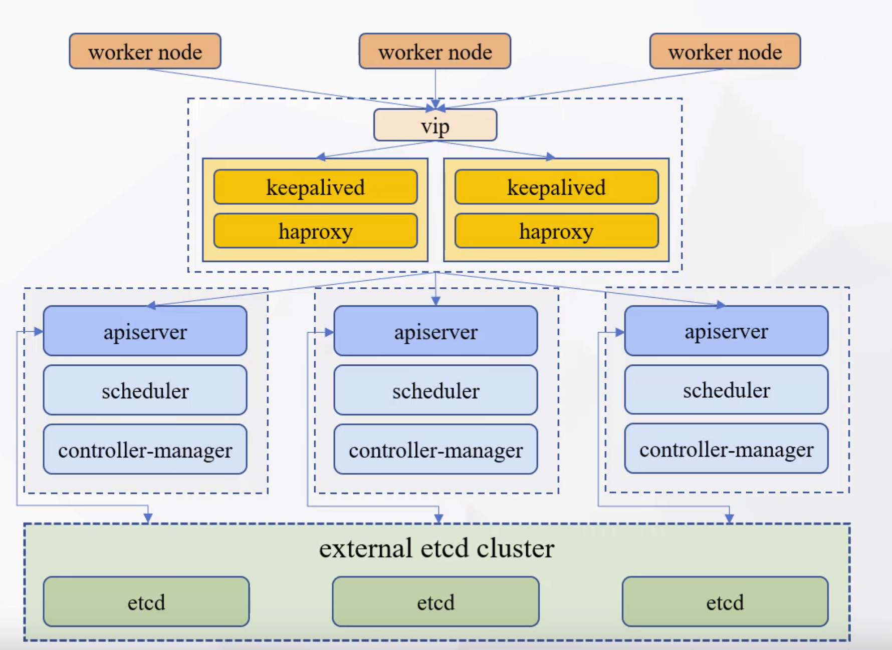
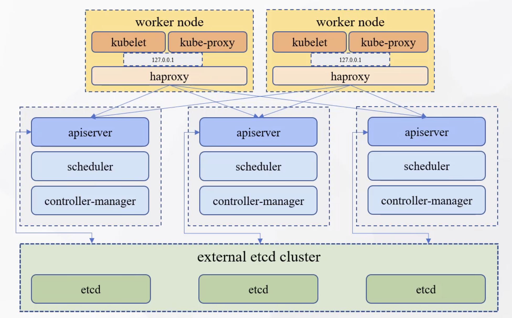

# kubekey官方

https://kubesphere.io/zh/docs/installing-on-linux/introduction/kubekey/


# 核心命令说明

需要使用到的核心命令如下

```shell
export KKZONE=cn
curl -sfL https://get-kk.kubesphere.io | VERSION=v1.2.1 sh -
chmod +x kk

# 生成安装k8s的脚本
./kk create config config-sample.yaml

# 生成安装带有kubesphere的脚本
./kk create config --with-kubesphere v3.2.1 config-sample.yaml

# 创建集群
./kk create cluster -f config-sample.yaml
```


# 安装高可用k8s集群

## 安装方式选择

1）external loadBalancer



2）internal loadBalancer




## 节点规划

| 节点      | 名称     | 作用        |
| --------- | -------- | ----------- |
| 10.4.7.60 | master01 | master,etcd |
| 10.4.7.61 | master02 | master,etcd |
| 10.4.7.62 | master03 | master,etcd |
| 10.4.7.70 | node01   | worker      |
| 10.4.7.71 | node02   | worker      |
|           |          |             |

## 下载kubekey

我们这里，将采用第二种安装方式，internal loadBalancer；可以不用额外的机器资源，内部负载均衡

```shell
export KKZONE=cn
curl -sfL https://get-kk.kubesphere.io | VERSION=v1.2.1 sh -
chmod +x kk

# 生成安装k8s的脚本
./kk create config -f config-sample.yaml
```

## 修改配置文件

```yaml
apiVersion: kubekey.kubesphere.io/v1alpha1
kind: Cluster
metadata:
  name: sample
spec:
  hosts:
  - {name: master1, address: 10.4.7.60, internalAddress: 10.4.7.60, user: root, password: '123456'}
  - {name: master2, address: 10.4.7.61, internalAddress: 10.4.7.61, user: root, password: '123456'}
  - {name: master3, address: 10.4.7.62, internalAddress: 10.4.7.62, user: root, password: '123456'}
  - {name: node1, address: 10.4.7.70, internalAddress: 10.4.7.70, user: root, password: '123456'}
  - {name: node2, address: 10.4.7.71, internalAddress: 10.4.7.71, user: root, password: '123456'}
  roleGroups:
    etcd:
    - master1
    - master2
    - master3
    master:
    - master1
    - master2
    - master3
    worker:
    - node1
    - node2
  controlPlaneEndpoint:
    ##Internal loadbalancer for apiservers
    internalLoadbalancer: haproxy

    domain: lb.kubesphere.local
    address: ""
    port: 6443
  kubernetes:
    version: v1.21.5
    clusterName: cluster.local
  network:
    plugin: calico
    kubePodsCIDR: 10.233.64.0/18
    kubeServiceCIDR: 10.233.0.0/18
  registry:
    registryMirrors: []
    insecureRegistries: []
  addons: []
```

```yaml
apiVersion: kubekey.kubesphere.io/v1alpha1
kind: Cluster
metadata:
  name: sample
spec:
  hosts:
  - {name: node1, address: 10.4.7.80, internalAddress: 10.4.7.80, user: root, password: '123456'}
  roleGroups:
    etcd:
    - node1
    master:
    - node1
    worker:
    - node1
  controlPlaneEndpoint:
    ##Internal loadbalancer for apiservers
    #internalLoadbalancer: haproxy

    domain: lb.kubesphere.local
    address: ""
    port: 6443
  kubernetes:
    version: v1.21.5
    clusterName: cluster.local
  network:
    plugin: calico
    kubePodsCIDR: 10.233.64.0/18
    kubeServiceCIDR: 10.233.0.0/18
  registry:
    registryMirrors: []
    insecureRegistries: []
  addons: []

```


## 安装k8s集群

```shell
# 直接安装k8s集群
./kk create cluster -f config-sample.yaml

# 如果同时部署 kubesphere
./kk create cluster -f config-sample.yaml --with-kubesphere v3.2.1
```


Console: http://10.4.7.80:30880
Account: admin
Password: P@88w0rd

# 配置文件说明

```yaml
apiVersion: kubekey.kubesphere.io/v1alpha1
kind: Cluster
metadata:
  name: sample
spec:
  hosts: # 指定集群的节点信息，包括登录集群的账号密码
  - {name: master1, address: 10.4.7.60, internalAddress: 10.4.7.60, user: root, password: '123456'}
  - {name: master2, address: 10.4.7.61, internalAddress: 10.4.7.61, user: root, password: '123456'}
  - {name: master3, address: 10.4.7.62, internalAddress: 10.4.7.62, user: root, password: '123456'}
  - {name: node1, address: 10.4.7.70, internalAddress: 10.4.7.70, user: root, password: '123456'}
  - {name: node2, address: 10.4.7.71, internalAddress: 10.4.7.71, user: root, password: '123456'}
  roleGroups:
    etcd: # etcd安装的节点信息
    - master1
    - master2
    - master3
    master: # master安装的节点信息
    - master1
    - master2
    - master3
    worker: # worker安装的节点信息
    - node1
    - node2
  controlPlaneEndpoint:
    ##Internal loadbalancer for apiservers
    internalLoadbalancer: haproxy # 开启内部的Lb

    domain: lb.kubesphere.local
    address: "" #虚拟vip，如果是开启的内部的 lb，留空
    port: 6443
  kubernetes: # 安装k8s版本的信息
    version: v1.21.5
    clusterName: cluster.local
  network: # 选用k8s网络的信息
    plugin: calico
    kubePodsCIDR: 10.233.64.0/18
    kubeServiceCIDR: 10.233.0.0/18
  registry: # 远程仓库的配置信息
    registryMirrors: []
    insecureRegistries: []
  addons: [] # 初始化安装的时候，开启了哪些组件。可以不配置，后续在后台操作
```


# k8s证书

查看集群证书是否到期

```shell
./kk certs check-expiration
```

更新证书

```shell
# 集群证书位置
/etc/kubernetes/pki/

# 执行命令更新证书
./kk certs renew -f config.yaml
```


# k8s集群，增删节点

## 添加节点

1.修改 config.yaml文件

2.执行命令：./kk add nodes -f config.yaml


## 删除节点

1）停止调度节点

以 `admin` 身份登录控制台，访问**集群管理**页面。若要将节点标记为不可调度，从左侧菜单中选择**节点**下的**集群节点**，找到想要从集群中删除的节点，点击**停止调度**。

或直接执行命令 `kubectl cordon $NODENAME`。


2）./kk delete node <nodeName> -f config-sample.yaml

# 启用可插拔组件

文档:https://kubesphere.io/zh/docs/pluggable-components/

# 节点管理

文档：https://kubesphere.io/zh/docs/cluster-administration/nodes/

# 卸载k8s集群

```shell
./kk delete cluster -f config-sample.yaml
```


