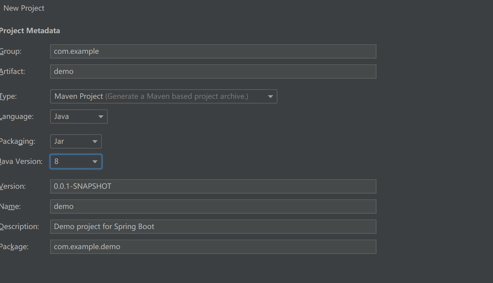
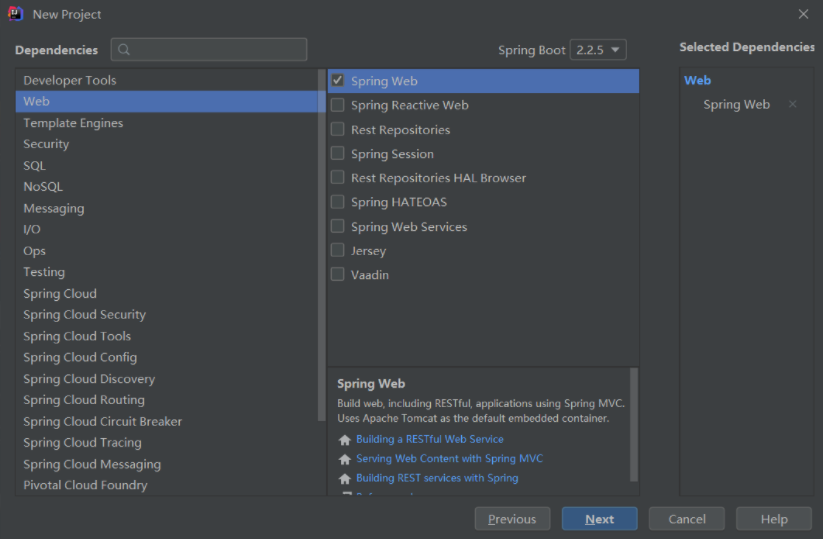
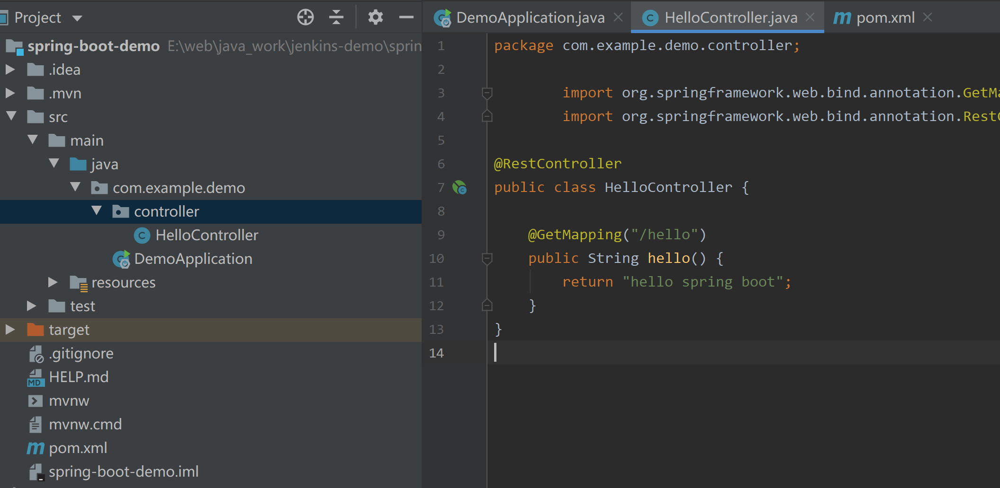
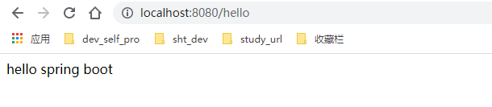

# springboot 发布到 k8s

## 开发 spring boot代码

### idea 创建项目

```
File-> new -> Projetc -> Spring Initiallzr -> next
```

```
# set project
```



 


### 代码

```java
package com.example.demo.controller;

import org.springframework.web.bind.annotation.GetMapping;
import org.springframework.web.bind.annotation.RestController;

@RestController
public class HelloController {

    @GetMapping("/hello")
    public String hello() {
        return "hello spring boot";
    }
}

```

 

 


## 代码发布到k8s

