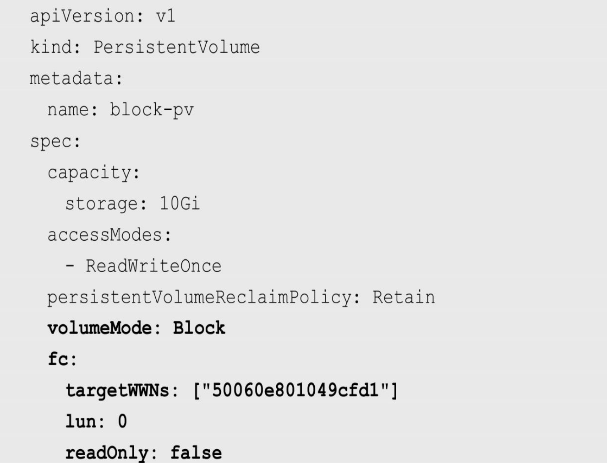
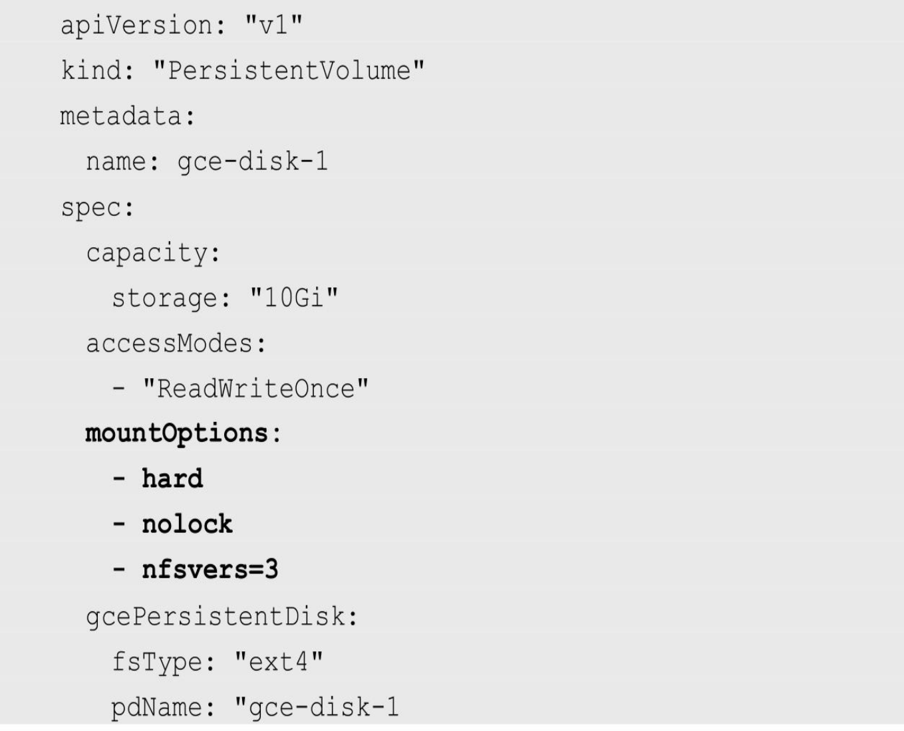
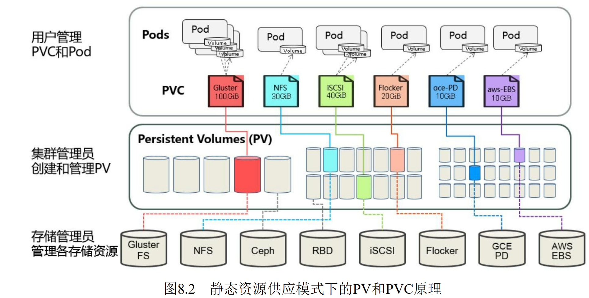
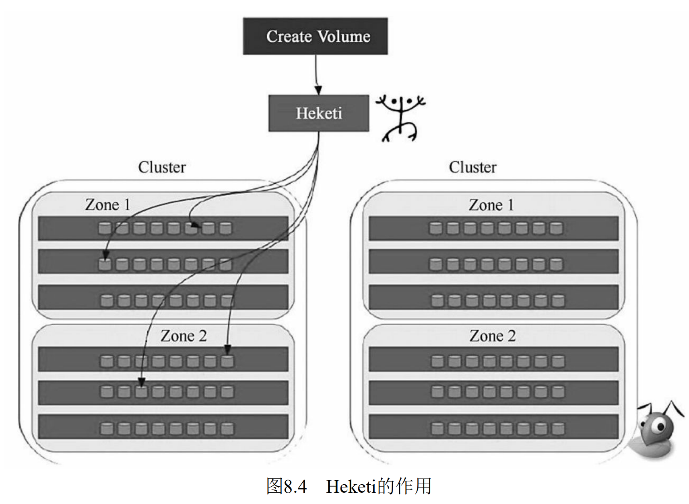

# 存储

## 共享存储机制概述

​		Kubernetes对于有状态的容器应用或者对数据需要持久化的应用， 不仅需要将容器内的目录挂载到宿主机的目录或者emptyDir临时存储 

卷，而且需要更加可靠的存储来保存应用产生的重要数据，以便容器应 用在重建之后仍然可以使用之前的数据。不过，存储资源和计算资源 

（CPU/内存）的管理方式完全不同。为了能够屏蔽底层存储实现的细 节，让用户方便使用，同时让管理员方便管理，Kubernetes从1.0版本就 

引入PersistentVolume（PV）和PersistentVolumeClaim（PVC）两个资源 对象来实现对存储的管理子系统。 

​		PV是对底层网络共享存储的抽象，将共享存储定义为一种“资源”， 比如Node也是一种容器应用可以“消费”的资源。PV由管理员创建和配 

置，它与共享存储的具体实现直接相关，例如GlusterFS、iSCSI、RBD或GCE或AWS公有云提供的共享存储，通过插件式的机制完成与共享 

存储的对接，以供应用访问和使用。 

​		PVC则是用户对存储资源的一个“申请”。就像Pod“消费”Node的资源一样，PVC能够“消费”PV资源。PVC可以申请特定的存储空间和访问 

模式。

​		使用PVC“申请”到一定的存储空间仍然不能满足应用对存储设备的各种需求。通常应用程序都会对存储设备的特性和性能有不同的要求， 

包括读写速度、并发性能、数据冗余等更高的要求，Kubernetes从1.4版本开始引入了一个新的资源对象StorageClass，用于标记存储资源的特性和性能。到1.6版本时，StorageClass和动态资源供应的机制得到了完善，实现了存储卷的按需创建，在共享存储的自动化管理进程中实现了重要的一步。 

​		通过StorageClass的定义，管理员可以将存储资源定义为某种类别 （Class），正如存储设备对于自身的配置描述（Profile），例如“快速存储”“慢速存储”“有数据冗余”“无数据冗余”等。用户根据StorageClass 的描述就能够直观地得知各种存储资源的特性，就可以根据应用对存储资源的需求去申请存储资源了。 

​		Kubernetes从1.9版本开始引入容器存储接口Container Storage Interface（CSI）机制，目标是在Kubernetes和外部存储系统之间建立一 套标准的存储管理接口，通过该接口为容器提供存储服务，类似于 CRI（容器运行时接口）和CNI（容器网络接口）。 


## **PV**详解 

​		PV作为存储资源，主要包括存储能力、访问模式、存储类型、回收策略、后端存储类型等关键信息的设置。下面的例子声明的PV具有 

如下属性：5GiB存储空间，访问模式为ReadWriteOnce，存储类型为 slow（要求在系统中已存在名为slow的StorageClass），回收策略为 Recycle，并且后端存储类型为nfs（设置了NFS Server的IP地址和路径）：

```yaml
apiVersion: v1
kind: PersistentVolume
metadata:
  name: pv1
spec:
  capacity:
    storage: 5Gi
  accessModes:
    - ReadWriteOnce
  persistentVolumeReclaimPolicy: Recycle
  storageClassName: slow
  nfs:
    path: /tmp
    server: 172.17.0.2
```

Kubernetes支持的PV类型如下。 

◎ AWSElasticBlockStore：AWS公有云提供的ElasticBlockStore。 

◎ AzureFile：Azure公有云提供的File。 

◎ AzureDisk：Azure公有云提供的Disk。 

◎ CephFS：一种开源共享存储系统。◎ FC（Fibre Channel）：光纤存储设备。 

◎ FlexVolume：一种插件式的存储机制。 

◎ Flocker：一种开源共享存储系统。 

◎ GCEPersistentDisk：GCE公有云提供的PersistentDisk。 

◎ Glusterfs：一种开源共享存储系统。 

◎ HostPath：宿主机目录，仅用于单机测试。 

◎ iSCSI：iSCSI存储设备。 

◎ Local：本地存储设备

◎ NFS：网络文件系统。 

◎ Portworx Volumes：Portworx提供的存储服务。 

◎ Quobyte Volumes：Quobyte提供的存储服务。 

◎ RBD（Ceph Block Device）：Ceph块存储。 

◎ ScaleIO Volumes：DellEMC的存储设备。 

◎ StorageOS：StorageOS提供的存储服务。 

◎ VsphereVolume：VMWare提供的存储系统。 


### **PV**的关键配置参数

**1.**存储能力（**Capacity**） 

描述存储设备具备的能力，目前仅支持对存储空间的设置 （storage=xx），未来可能加入IOPS、吞吐率等指标的设置。 


**2.**存储卷模式（**Volume Mode**） 

Kubernetes从1.13版本开始引入存储卷类型的设置 （volumeMode=xxx），可选项包括Filesystem（文件系统）和Block（块设备），默认值为Filesystem。 

目前有以下PV类型支持块设备类型： 

◎ AWSElasticBlockStore 

◎ AzureDisk 

◎ FC 

◎ GCEPersistentDisk 

◎ iSCSI 

◎ Local volume 

◎ RBD（Ceph Block Device） 

◎ VsphereVolume（alpha） 

 

**3.**访问模式（**Access Modes**） 

对PV进行访问模式的设置，用于描述用户的应用对存储资源的访 

问权限。访问模式如下。 

◎ ReadWriteOnce（RWO）：读写权限，并且只能被单个Node挂载。

◎ ReadOnlyMany（ROX）：只读权限，允许被多个Node挂载。 

◎ ReadWriteMany（RWX）：读写权限，允许被多个Node挂载。 

某些PV可能支持多种访问模式，但PV在挂载时只能使用一种访问模式，多种访问模式不能同时生效。 


**4.**存储类别（**Class**） 

​		PV可以设定其存储的类别，通过storageClassName参数指定一个StorageClass资源对象的名称。具有特定类别的PV只能与请求了该类别 的PVC进行绑定。未设定类别的PV则只能与不请求任何类别的PVC进行绑定。


**5.**回收策略（**Reclaim Policy**） 

通过PV定义中的persistentVolumeReclaimPolicy字段进行设置，可 

选项如下。 

◎ 保留：保留数据，需要手工处理。 

◎ 回收空间：简单清除文件的操作（例如执行rm -rf /thevolume/* 命令）。

◎ 删除：与PV相连的后端存储完成Volume的删除操作（如AWS EBS、GCE PD、Azure Disk、OpenStack Cinder等设备的内部Volume清 理）。

目前，只有NFS和HostPath两种类型的存储支持Recycle策略；AWS EBS、GCE PD、Azure Disk和Cinder volumes支持Delete策略。 


**6.**挂载参数（**Mount Options**） 

​		在将PV挂载到一个Node上时，根据后端存储的特点，可能需要设 置额外的挂载参数，可以根据PV定义中的mountOptions字段进行设置。 

下面的例子为对一个类型为gcePersistentDisk的PV设置挂载参数：

 

目前，以下PV类型支持设置挂载参数： 

◎ AWSElasticBlockStore 

◎ AzureDisk 

◎ AzureFile 

◎ CephFS 

◎ Cinder (OpenStack block storage) 

◎ GCEPersistentDisk 

◎ Glusterfs 

◎ NFS 

◎ Quobyte Volumes 

◎ RBD (Ceph Block Device) 

◎ StorageOS

◎ VsphereVolume 

◎ iSCSI


**7.**节点亲和性（**Node Affinity**）

​		PV可以设置节点亲和性来限制只能通过某些Node访问Volume，可 以在PV定义中的nodeAffinity字段进行设置。使用这些Volume的Pod将 

被调度到满足条件的Node上。 这个参数仅用于Local存储卷，例如： 

 

公有云提供的存储卷（如AWS EBS、GCE PD、Azure Disk等）都 由公有云自动完成节点亲和性设置，无须用户手工设置。


### **PV**生命周期的各个阶段

某个PV在生命周期中可能处于以下4个阶段（Phaes）之一。 

◎ Available：可用状态，还未与某个PVC绑定。 

◎ Bound：已与某个PVC绑定。 

◎ Released：绑定的PVC已经删除，资源已释放，但没有被集群 回收。

◎ Failed：自动资源回收失败。 


## **PVC**详解

​		PVC作为用户对存储资源的需求申请，主要包括存储空间请求、访 问模式、PV选择条件和存储类别等信息的设置。下例声明的PVC具有 如下属性：申请8GiB存储空间，访问模式为ReadWriteOnce，PV 选择条件为包含标签“release=stable”并且包含条件为“environment In [dev]”的 标签，存储类别为“slow”（要求在系统中已存在名为slow的 StorageClass）： 

```yaml
kind: PersistentVolumeClaim
apiVersion: v1
metadata:
  name: myclaim
spec:
  accessModes:
    - ReadWriteOnce
  resources:
    requests:
      storage: 8Gi
  storageClassName: slow
  selector:
    matchLabels:
      release: "stabel"
    matchExpressions:
      - {key: environment, operator: In, values: [dev]}
```

PVC的关键配置参数说明如下。 

◎ 资源请求（Resources）：描述对存储资源的请求，目前仅支持 request.storage的设置，即存储空间大小。 

◎ 访问模式（Access Modes）：PVC也可以设置访问模式，用于描述用户应用对存储资源的访问权限。其三种访问模式的设置与PV的 设置相同。 

◎ 存储卷模式（Volume Modes）：PVC也可以设置存储卷模式， 用于描述希望使用的PV存储卷模式，包括文件系统和块设备。 

◎ PV选择条件（Selector）：通过对Label Selector的设置，可使 PVC对于系统中已存在的各种PV进行筛选。系统将根据标签选出合适 的PV与该PVC进行绑定。选择条件可以使用matchLabels和 matchExpressions进行设置，如果两个字段都设置了，则Selector的逻辑将是两组条件同时满足才能完成匹配。 

◎ 存储类别（Class）：PVC 在定义时可以设定需要的后端存储的类别（通过storageClassName字段指定），以减少对后端存储特性的详细信息的依赖。只有设置了该Class的PV才能被系统选出，并与该PVC进行绑定。 


## **PV**和**PVC**的生命周期

我们可以将PV看作可用的存储资源，PVC则是对存储资源的需 求，PV和PVC的相互关系遵循如图8.1所示的生命周期。

 

### 资源供应

Kubernetes支持两种资源的供应模式：静态模式（Static）和动态模 式（Dynamic）。资源供应的结果就是创建好的PV。 

◎ 静态模式：集群管理员手工创建许多PV，在定义PV时需要将 后端存储的特性进行设置。 

◎ 动态模式：集群管理员无须手工创建PV，而是通过 StorageClass的设置对后端存储进行描述，标记为某种类型。此时要求 PVC对存储的类型进行声明，系统将自动完成PV的创建及与PVC的绑 定。PVC可以声明Class为""，说明该PVC禁止使用动态模式。


### 资源绑定

​		在用户定义好PVC之后，系统将根据PVC对存储资源的请求（存储空间和访问模式）在已存在的PV中选择一个满足PVC要求的PV，一旦找到，就将该PV与用户定义的PVC进行绑定，用户的应用就可以使用这个PVC了。如果在系统中没有满足PVC要求的PV，PVC则会无限期处于Pending状态，直到等到系统管理员创建了一个符合其要求的PV。PV一旦绑定到某个PVC上，就会被这个PVC独占，不能再与其他PVC进行绑定了。在这种情况下，当PVC申请的存储空间比PV的少时，整个PV的空间就都能够为PVC所用，可能会造成资源的浪费。如果资源供应使用的是动态模式，则系统在为PVC找到合适的StorageClass后，将自动创 建一个PV并完成与PVC的绑定。 


### 资源使用

​		Pod使用Volume的定义，将PVC挂载到容器内的某个路径进行使用。Volume的类型为persistentVolumeClaim，在后面的示例中再进行详细说明。在容器应用挂载了一个PVC后，就能被持续独占使用。不过，多个Pod可以挂载同一个PVC，应用程序需要考虑多个实例共同访问一块存储空间的问题。 


### 资源释放 

​		当用户对存储资源使用完毕后，用户可以删除PVC，与该PVC绑定的PV将会被标记为“已释放”，但还不能立刻与其他PVC进行绑定。通过之前PVC写入的数据可能还被留在存储设备上，只有在清除之后该PV才能再次使用。


### 资源回收 

​		对于PV，管理员可以设定回收策略，用于设置与之绑定的PVC释放资源之后如何处理遗留数据的问题。只有PV的存储空间完成回收， 才能供新的PVC绑定和使用。回收策略详见下节的说明。 

​		下面通过两张图分别对在静态资源供应模式和动态资源供应模式下，PV、PVC、StorageClass及Pod使用PVC的原理进行说明。 

​		图8.2描述了在静态资源供应模式下，通过PV和PVC完成绑定，并供Pod使用的存储管理机制。 

 

图8.3描述了在动态资源供应模式下，通过StorageClass和PVC完成资源动态绑定（系统自动生成PV），并供Pod使用的存储管理机制。

 


## **StorageClass**详解 

​		StorageClass作为对存储资源的抽象定义，对用户设置的PVC申请屏蔽后端存储的细节，一方面减少了用户对于存储资源细节的关注，另一 方面减轻了管理员手工管理PV的工作，由系统自动完成PV的创建和绑定，实现了动态的资源供应。基于StorageClass的动态资源供应模式将 逐步成为云平台的标准存储配置模式。 

​		StorageClass的定义主要包括名称、后端存储的提供者（provisioner）和后端存储的相关参数配置。StorageClass一旦被创建出来，则将无法修改。如需更改，则只能删除原StorageClass的定义重建。下例定义了一个名为standard的StorageClass，提供者为aws-ebs，其参数设置了一个type，值为gp2： 

```yaml
kind: StorageClass
apiVersion: storage.k8s.io/v1
metadata:
  name: standard
provisioner: kubernetes.io/aws-ebs
parameters:
  type: gp2
```


### **StorageClass**的关键配置参数

**1.**提供者（**Provisioner**） 

描述存储资源的提供者，也可以看作后端存储驱动。目前Kubernetes支持的Provisioner都以“kubernetes.io/”为开头，用户也可以使用自定义的后端存储提供者。为了符合StorageClass的用法，自定义Provisioner需要符合存储卷的开发规范，详见https://github.com/kubernetes/community/blob/master/contributors/design- proposals/volume-provisioning.md的说明。 

**2.**参数（**Parameters**） 

后端存储资源提供者的参数设置，不同的Provisioner包括不同的参数设置。某些参数可以不显示设定，Provisioner将使用其默认值。 接下来通过几种常见的Provisioner对StorageClass的定义进行详细说明。


### 设置默认的**StorageClass** 

​		要在系统中设置一个默认的StorageClass，则首先需要启用名为 DefaultStorageClass的admission controller，即在kube-apiserver的命令行 参数--admission-control中增加： 

```
	--admission-control=..., DefaultStorageClass
```

然后，在StorageClass的定义中设置一个annotation： 

 

通过kubectl create命令创建成功后，查看StorageClass列表，可以看 到名为gold的StorageClass被标记为default：


## 动态存储管理实战：**GlusterFS**

### 准备工作 

为了能够使用GlusterFS，首先在计划用于GlusterFS的各Node上安 装GlusterFS客户端： 

在node上安装Gluster客户端(Heketi要求GlusterFS集群至少有三个节点)

```shell
$ yum install glusterfs glusterfs-fuse
```

GlusterFS管理服务容器需要以特权模式运行，在kube-apiserver的启动参数中增加： 

```
--allow-privileged=true
```

给要部署GlusterFS管理服务的节点打上“storagenode=glusterfs”的标签，是为了将GlusterFS容器定向部署到安装了GlusterFS的Node上： 

```shell
$ kubectl label node k8s-node01 storagenode=glusterfs
$ kubectl label node k8s-node02 storagenode=glusterfs
$ kubectl label node k8s-node03 storagenode=glusterfs
```


### 创建**GlusterFS**管理服务容器集群 

GlusterFS管理服务容器以DaemonSet的方式进行部署，确保在每个Node上都运行一个GlusterFS管理服务。glusterfs-daemonset.yaml的内容如下：

glusterfs-daemonset.yaml

```yaml
kind: DaemonSet
apiVersion: extensions/v1beta1
metadata:
  name: glusterfs
  labels:
    glusterfs: daemonsett
  annotations:
    description: GlusterFS DaemonSet
    tags: glusterfs
spec:
  template:
    metadata:
      name: glusterfs
      labels:
        glusterfs-node: pod
    spec:
      nodeSelector:
        storagenode: glusterfs
      hostNetwork: true
      containers:
      - image: gluster/gluster-centos:latest
        name: glusterfs
        volumeMounts:
        - name: glusterfs-heketi
          mountPath: "/var/lib/heketi"
        - name: glusterfs-run
          mountPath: "/run"
        - name: glusterfs-lvm
          mountPath: "/run/lvm"
        - name: glusterfs-etc
          mountPath: "/etc/glusterfs"
        - name: glusterfs-logs
          mountPath: "/var/log/glusterfs"
        - name: glusterfs-config
          mountPath: "/var/lib/glusterd"
        - name: glusterfs-dev
          mountPath: "/dev"
        - name: glusterfs-misc
          mountPath: "/var/lib/misc/glusterfsd"
        - name: glusterfs-cgroup
          mountPath: "/sys/fs/cgroup"
          readOnly: true
        - name: glusterfs-ssl
          mountPath: "/etc/ssl"
          readOnly: true
        securityContext:
          capabilities: {}
          privileged: true
        readinessProbe:
          timeoutSeconds: 3
          initialDelaySeconds: 60
          exec:
            command:
            - "/bin/bash"
            - "-c"
            - systemctl status glusterd.service
        livenessProbe:
           timeoutSeconds: 3
           initialDelaySeconds: 60
           exec:
             command:
             - "/bin/bash"
             - "-c"
             - systemctl status glusterd.service
      volumes:
      - name: glusterfs-heketi
        hostPath:
          path: "/var/lib/heketi"
      - name: glusterfs-run
      - name: glusterfs-lvm
        hostPath:
          path: "/run/lvm"
      - name: glusterfs-etc
        hostPath:
          path: "/etc/glusterfs"
      - name: glusterfs-logs
        hostPath:
          path: "/var/log/glusterfs"
      - name: glusterfs-config
        hostPath:
          path: "/var/lib/glusterd"
      - name: glusterfs-dev
        hostPath:
          path: "/dev"
      - name: glusterfs-misc
        hostPath:
          path: "/var/lib/misc/glusterfsd"
      - name: glusterfs-cgroup
        hostPath:
          path: "/sys/fs/cgroup"
      - name: glusterfs-ssl
        hostPath:
          path: "/etc/ssl"
```

```shell
$ kubectl create -f glusterfs-daemonset.yaml

$ kubectl get po
```


### 创建**Heketi**服务 

​		Heketi 是一个提供RESTful API管理GlusterFS卷的框架，并能够在OpenStack、Kubernetes、OpenShift等云平台上实现动态存储资源供应， 支持GlusterFS多集群管理，便于管理员对GlusterFS进行操作。图8.4简 单描述了Heketi的作用。 

  

在部署Heketi服务之前，需要为它创建一个ServiceAccount对象：

heketi-service-account.yaml

```yaml
apiVersion: v1
kind: ServiceAccount
metadata:
  name: heketi-service-account
```

```shell
$ kubectl create -f heketi-service-account.yaml
```

部署heketi服务:

heketi-deployment-svc.yaml

```yaml
---
kind: Deployment
apiVersion: extensions/v1beta1
metadata:
  name: deploy-heketi
  labels:
    glusterfs: heketi-deployment
    deploy-heketi: heket-deployment
  annotations:
    description: Defines how to deploy Heketi
spec:
  replicas: 1
  template:
    metadata:
      name: deploy-heketi
      labels:
        glusterfs: heketi-pod
        name: deploy-heketi
    spec:
      serviceAccountName: heketi-service-account
      containers:
      - image: heketi/heketi
        imagePullPolicy: IfNotPresent
        name: deploy-heketi
        env:
        - name: HEKETI_EXECUTOR
          value: kubernetes
        - name: HEKETI_FSTAB
          value: "/var/lib/heketi/fstab"
        - name: HEKETI_SNAPSHOT_LIMIT
          value: '14'
        - name: HEKETI_KUBE_GLUSTER_DAEMONSET
          value: "y"
        ports:
        - containerPort: 8080
        volumeMounts:
        - name: db
          mountPath: "/var/lib/heketi"
        readinessProbe:
          timeoutSeconds: 3
          initialDelaySeconds: 3
          httpGet:
            path: "/hello"
            port: 8080
        livenessProbe:
          timeoutSeconds: 3
          initialDelaySeconds: 30
          httpGet:
            path: "/hello"
            port: 8080
      volumes:
      - name: db
        hostPath:
            path: "/heketi-data"
 
---
kind: Service
apiVersion: v1
metadata:
  name: deploy-heketi
  labels:
    glusterfs: heketi-service
    deploy-heketi: support
  annotations:
    description: Exposes Heketi Service
spec:
  selector:
    name: deploy-heketi
  ports:
  - name: deploy-heketi
    port: 8080
    targetPort: 8080
```

```shell
$ kubectl create -f heketi-deployment-svc.yaml

$ kubectl get svc && kubectl get deploument　　 
$ kubectl describe pod deploy-heketi
```

需要注意的是，Heketi的DB数据需要持久化保存，建议使用hostPath或其他共享存储进行保存： 


### 为**Heketi**设置**GlusterFS**集群

​		在Heketi能够管理GlusterFS集群之前，首先要为其设置GlusterFS集群的信息。可以用一个topology.json配置文件来完成各个GlusterFS节点 和设备的定义。Heketi要求在一个GlusterFS集群中至少有3个节点。在topology.json配置文件hostnames字段的manage上填写主机名，在storage 上填写IP地址，devices要求为未创建文件系统的裸设备（可以有多块盘），以供Heketi自动完成PV（Physical Volume）、VG（Volume Group）和LV（Logical Volume）的创建。topology.json文件的内容如下：

```shell
yum install -y centos-release-gluster
yum install -y heketi heketi-client  
```

topology.json

```json
{
  "clusters": [
    {
      "nodes": [
        {
          "node": {
            "hostnames": {
              "manage": [
                "k8s"
              ],
              "storage": [
                "192.168.66.86"
              ]
            },
            "zone": 1
          },
          "devices": [
            "/dev/vdb"
          ]
        },
        {
          "node": {
            "hostnames": {
              "manage": [
                "k8s-node1"
              ],
              "storage": [
                "192.168.66.87"
              ]
            },
            "zone": 1
          },
          "devices": [
            "/dev/vdb"
          ]
        },
        {
          "node": {
            "hostnames": {
              "manage": [
                "k8s-node2"
              ],
              "storage": [
                "192.168.66.84"
              ]
            },
            "zone": 1
          },
          "devices": [
            "/dev/vdb"
          ]
        }
      ]
    }
  ]
}
```

进入Heketi容器，使用命令行工具heketi-cli完成GlusterFS集群的创建：

```
export HEKETI_CLI_SERVER=http://localhost:8080

heketi-cli topology load --json=topology.json
```

经过这个操作，Heketi完成了GlusterFS集群的创建，同时在 GlusterFS集群的各个节点的/dev/sdb盘上成功创建了PV和VG。

查看Heketi的topology信息，可以看到Node和Device的详细信息，包括磁盘空间的大小和剩余空间。此时，Volume和Brick还未创建：

```
heketi-cli topology info
```


### 定义**StorageClass**

准备工作已经就绪，集群管理员现在可以在Kubernetes集群中定义一个StorageClass了。storageclass-gluster-heketi.yaml配置文件的内容如下：

netstat -anp | grep 8080 查看resturl地址，resturl必须设置为API Server能访问Heketi服务的地址

storageclass-gluster-heketi.yaml

```yaml
apiVersion: storage.k8s.io/v1
kind: StorageClass
metadata:
  name: gluster-heketi
provisioner: kubernetes.io/glusterfs
parameters:
  resturl: "http://127.0.0.1:8080"
  restauthenabled: "false"
```

​		Provisioner参数必须被设置为“kubernetes.io/glusterfs”。 

​		resturl的地址需要被设置为API Server所在主机可以访问到的Heketi服务的某个地址，可以使用服务ClusterIP+端口号、容器IP地址+端口 号，或将服务映射到物理机，使用物理机IP+NodePort。 

​		创建这个StorageClass资源对象： 

```shell
$ kubectl create -f storageclass-gluster-heketi.yaml
```


### 定义**PVC** 

现在，用户可以申请一个PVC了。例如，一个用户申请一个1GiB空 间的共享存储资源，StorageClass使用“gluster-heketi”，未定义任何 Selector，说明使用动态资源供应模式：

pvc-gluster-heketi.yaml

```yaml
kind: PersistentVolumeClaim
apiVersion: v1
metadata:
  name: pvc-gluster-heketi
spec:
  storageClassName: gluster-heketi
  accessModes:
    - ReadWriteOnce
  resources:
    requests:
      storage: 1Gi
```

```bash
$ kubectl create -f pvc-gluster-heketi.yaml

```

PVC的定义一旦生成，系统便将触发Heketi进行相应的操作，主要 为在GlusterFS集群上创建brick，再创建并启动一个Volume。整个过程 可以在Heketi的日志中查到

查看PVC的状态，可见其已经为Bound（已绑定）： 

```shell
$ kubectl get pvc
```

查看PV，可见系统自动创建的PV：

```shell
$ kubectl get pv
```

查看该PV的详细信息，可以看到其容量、引用的StorageClass等信 息都已正确设置，状态也为Bound，回收策略则为默认的Delete。同时 Gluster的Endpoint和Path也由Heketi自动完成了设置： 

```shell
$ kubectl describe pv pvc-789487
```

至此，一个可供Pod使用的PVC就创建成功了。接下来Pod就能通过 Volume的设置将这个PVC挂载到容器内部进行使用了。 


### **Pod**使用**PVC**的存储资源 

在Pod中使用PVC定义的存储资源非常容易，只需设置一个 Volume，其类型为persistentVolumeClaim，即可轻松引用一个PVC。下 例中使用一个busybox容器验证对PVC的使用，注意Pod需要与PVC属于同一个Namespace：

pod-use-pvc.yaml

```yaml
apiVersion: v1
kind: Pod
metadata:
  name: pod-use-pvc
spec:
  containers:
  - name: pod-pvc
    image: busybox
    command:
    - sleep
    - "3600"
    volumeMounts:
    - name: gluster-volume
      mountPath: "/mnt"
      readOnly: false
  volumes:
  - name: gluster-volume
    persistentVolumeClaim:
      claimName: pvc-gluster-heketi
```

```shell
$ kubectl create -f pod-use-pvc.yaml
```

进入容器pod-use-pvc，在/pv-data目录下创建一些文件： 

```shell
$ kubectl exec -it pod-use-pvc -- /bin/sh
/ # cd /pv-data
/ # touch a
/ # echo "hello" > b
```

可以验证文件a和b在GlusterFS集群中是否正确生成。 

```
	df -h:  查看挂载那台的glusterfs
    在node节点进入glusterfs节点查看文件
    docker exec -ti 89f927aa2110 /bin/bash
    find / -name b.txt
    cat /var/lib/heketi/mounts/vg_22e127efbdefc1bbb315ab0fcf90e779/brick_97de1365f98b19ee3b93ce8ecb588366/brick/b.txt
```


    或者在k8s集群master上查看
    进入相应的glusterfs集群几点
    kubectl exec -ti glusterfs-h4k22 -- /bin/sh
    find / -name b.txt
    cat /var/lib/heketi/mounts/vg_22e127efbdefc1bbb315ab0fcf90e779/brick_97de1365f98b19ee3b93ce8ecb588366/brick/b.txt

​		至此，使用Kubernetes最新的动态存储供应模式，配合StorageClass 和Heketi共同搭建基于GlusterFS的共享存储就完成了。有兴趣的读者可 以继续尝试StorageClass的其他设置，例如调整GlusterFS的Volume类型、修改PV的回收策略等。 在使用动态存储供应模式的情况下，相对于静态模式的优势至少包 括如下两点。 

（1）管理员无须预先创建大量的PV作为存储资源。 

（2）用户在申请PVC时无法保证容量与预置PV的容量完全匹配。 

从Kubernetes 1.6版本开始，建议用户优先考虑使用StorageClass的动态 存储供应模式进行存储管理。


### 参考

https://www.cnblogs.com/The-day-of-the-wind/p/12753337.html